# Finer OS — Who Said What, and What Happened Next

**An auditable investment-research record system · F0–F8**

[中文](README.md) · **English**

<p align="center">
  <a href="https://github.com/kelipovanatalja453-bot/finer/actions/workflows/ci.yml"></a>
  
  
  
  
  <a href="https://finer.t800.click"></a>
</p>

> **Finer doesn't tell you who is more accurate. It lets you audit exactly who said what, when — what the market did next, and whether they acted as they spoke.**

Three pillars, none of which depend on predictive power:

1. **Drill-down records** — every number reaches its source evidence span (`EvidenceSpan` character range) within 3 clicks
2. **Honest statistics** — insufficient samples are reported as insufficient; absence of persistence is stated outright
3. **Say-do consistency** — "bullish in words, selling in deeds" is an evidence-anchored fact, requiring no predictive assumption

Finer OS runs an F0–F8 pipeline that ingests financial KOL content and broker research — chat logs, image-based strategy posts, Feishu docs, PDFs, audio/video transcripts — normalizes it into structured content blocks, extracts evidence-linked investment intents, maps them into reviewable trade actions, and matches every statement against what the market did next from a full-follower's accounting — as a drill-down, auditable historical record, not a prediction of future performance.

[🌐 Live Demo](https://finer.t800.click) · [Quick Start](#quick-start) · [Records & Consensus](#records--consensus-three-read-only-views-on-the-real-corpus) · [Capabilities](#four-core-capabilities) · [Settled Records](#settled-records-an-evidence-chain-behind-every-return-curve) · [Architecture](#architecture) · [API](docs/API_REFERENCE.md)

<p align="center">
  <a href="https://finer.t800.click"></a>
  <br>
  <em>KOL Research View — historical record card, cumulative-return curve (historical fact), evidence-chain provenance · <a href="https://finer.t800.click">🌐 Try it live</a> (sample data)</em>
</p>

---

## 🌐 Live Demo

No signup, no backend — open it in a browser and walk the whole pipeline. All data is sample data. The demo workbench shows the pre-pivot product form; the current consumer surface is described in [Records & Consensus](#records--consensus-three-read-only-views-on-the-real-corpus).

**👉 [finer.t800.click](https://finer.t800.click)**

- **F0 → F8 pipeline walk-through** — click any stage to see how one piece of content becomes a traceable trade action
- **KOL research view** — switch between 5 sample KOLs; see historical record cards, cumulative-return curves (with methodology caveats), and viewpoint lists
- **Evidence-chain provenance** — click a `TradeAction` to highlight its source spans and four execution clocks
- **Backtest curve** — cumulative return, Sharpe, max drawdown, win rate (historical record; not a prediction of future performance); red = up, China convention
- **RLHF review** — simulate human adjudication, producing an `RLHFFeedback` record (demo, not persisted)

<p align="center">
  <a href="https://finer.t800.click/demo"></a>
  <br>
  <em>Live demo workbench — pure front-end mock, sample data, no real backend</em>
</p>

---

## Why Finer

Financial creators and broker analysts publish high-signal investment reasoning inside noisy timelines: long chat logs, image-based strategy posts, Feishu docs, research PDFs, livestream transcripts, and short-form market comments. A simple sentiment classifier can't answer the real questions:

> Who said this, and when? What did the market do next? Did they act as they spoke?

Finer OS is built around those three questions. It turns unstructured content into **evidence-traceable** investment intents, maps those intents into **reviewable** trade actions, and connects them to timeline analysis and backtesting — where every conclusion can be traced back to its original source, and every record honestly states its own scope and limits.

We also tested the more tempting question — whether past performance predicts future performance. On 2,983 settled samples, across two metrics, six split points, and pre-declared criteria, the answer was no, twice over: a broker's past excess performance does not predict its future excess performance. The criteria were hard-coded before the results in `scripts/test_credibility_persistence.py` (the `CRITERION_*` constants), and the conclusion is reproducible. We published this negative result and repositioned the product around honest record-keeping — honest statistics isn't a slogan; it starts with testing our own premise.

---

## One Piece of Content, All the Way Through F0 → F8

Every stage has a frozen input/output contract. Raw content goes in, structured judgments come out, and intermediate artifacts are persisted layer by layer for human review — **not a black box**.

```mermaid
flowchart LR
    S0[Raw Sources] --> F0[F0 Intake / ContentRecord]
    F0 --> F1[F1 Standardize / ContentEnvelope]
    F1 --> F15[F1.5 Topic Assembly / TopicBlock]
    F15 --> F2[F2 Anchor / Quality + TemporalAnchor + EvidenceSpan]
    F2 --> F3[F3 Intent / NormalizedInvestmentIntent]
    F3 --> F4[F4 Policy / PolicyMappingResult]
    F4 --> F5[F5 Execute / TradeAction]
    F5 --> F6[F6 Review / Human + RLHF]
    F6 --> F7[F7 Timeline / ViewpointState]
    F7 --> F8[F8 Backtest / Settled Records]
    F8 -.-> FT[F+ Training Loop / SFT + DPO]
```



---

## Records & Consensus: Three Read-Only Views on the Real Corpus

All three read-only views consume the real corpus: **28,565** foreign-broker research PDFs (73GB, a **static archive** covering roughly 10 months, 2025-09 ~ 2026-06), yielding **4,919** canonical `TradeAction` records with **100%** three-way audit coverage across **128,905** evidence spans. On the marketing site you can open each source's frozen snapshot directly: [finer.t800.click/records](https://finer.t800.click/records) (frozen 2026-08-10, with each record's rating, target price, and settlement result).

| View | In one line | Highlights |
|:---|:---|:---|
| `/discover` source record cards | Each card is a historical record, not a recommendation | Default order by settled sample count (a stable output order, not a ranking); hit rates always paired with 95% intervals; persistence-test statement in the page header; stock ratings and sector views kept in separate accounting (signal-class toggle) |
| `/ticker` per-ticker consensus | Who said what, as of which date | Equal-weight, latest report per source only; target-price low / median / high; staleness banner at the top of the page; per-row `intent_id` drill-down; explicit refusal when honest aggregation is impossible |
| `/audit` evidence audit | Every number goes back to the source text | `TradeAction` → F3 intent → F4 policy trace → F2 evidence-span character range → source text; `canonical_trace_status` validation |

<p align="center">
  
  <br>
  <em>/discover source record cards — records, not rankings · real corpus, captured 2026-08-10</em>
</p>

<p align="center">
  
  <br>
  <em>/ticker per-ticker consensus — who said what, as of which date · real corpus, captured 2026-08-10 (the staleness banner is a product feature)</em>
</p>

<p align="center">
  
  <br>
  <em>/audit evidence audit — every number goes back to the source text · real corpus, captured 2026-08-10</em>
</p>

Real cases: NVDA has **9 sources**, all bullish, with target prices at **205 / 284 / 350 USD**; 0700.HK has 10 sources (HKD 650 / 745 / 800); **AZN.L is explicitly refused target-price aggregation because pounds and pence are mixed in the source data**, with both sides kept drillable — when honest aggregation is impossible, the product refuses rather than serving a wrong number.

Staleness is labeled honestly: the corpus is a static archive — the median ticker's latest report stops at **2025-12-19**, **70%** of tickers have had no update for over three months, and **69%** have only a single source. So the `/ticker` page header carries a banner — "records on this page as of X (N days ago)" — bucketed at 90 / 180 / 365 days. A negative fact turned into a product feature, not buried in a footnote.

Read-only API: `GET /api/creator/records` · `GET /api/creator/{creator_id}/record` · `GET /api/ticker/{symbol}/consensus` · `GET /api/audit/actions` · `GET /api/audit/actions/{trade_action_id}/trace`

---

## Settled Records: An Evidence Chain Behind Every Return Curve

<p align="center">
  
  <br>
  <em>Cumulative-return curve + evidence-chain provenance — every TradeAction traces back to F3 intent / F4 policy / F2 evidence (sample data)</em>
</p>

Every TradeAction that enters the backtest satisfies the canonical contract: it can be traced back to the F3 investment intent, the F4 policy mapping, the F2 evidence spans, and four explicitly distinguished execution clocks.

- Cumulative return, annualized, Sharpe, max drawdown, win rate (historical-record accounting) — **all auditable**
- Ratios ship with a sample-sufficiency verdict: when samples are insufficient, only counts are reported and no ratio is rendered
- Next-open fill model + **explicit fee / slippage assumptions**
- `intent_id` / `policy_id` / `evidence_span_ids` threaded end to end
- Every number traces back to the original content; all ratios and curves are historical records, not predictions of future performance

---

## Four Core Capabilities

| Stage | Capability | Description |
|:---|:---|:---|
| **F0 · F1** | Ingest & Normalize | Unified intake of multi-source content (Feishu, Bilibili, broker research PDFs; WeChat Official Accounts as a legacy archive), standardized into `ContentEnvelope` + `ContentBlock` with source anchors and raw archives preserved. |
| **F2** | Anchor the Evidence Chain | Entity resolution, temporal anchoring, and evidence-span (`EvidenceSpan`) extraction. Every judgment traces back to the source's character range and original timestamp. |
| **F3 · F4 · F5** | Intent → Policy → Execute | Investment-intent extraction → policy mapping → `TradeAction` generation. Each action carries `intent_id` / `policy_id` / `evidence_span_ids` and four-clock execution timing. |
| **F8** | Backtest & Settled Records | Match language opinions against market outcomes and settle them into drill-down records; all ratios ship with a sample-sufficiency verdict (count-only when insufficient) and are historical records, not predictions of future performance. |

---

## AI · Human-in-the-Loop

AI does **concrete, verifiable** work at each stage. The hard gate into the backtest is the three-way audit loop — `intent` / `policy` / `evidence` 100% traceable end to end; F6 human review is sampled / on-demand adjudication, recorded as structured fields and exported as DPO training data — Finer's most concrete answer to "black-box AI."

<table>
<tr>
<th>🤖 What AI does</th>
<th>🧑‍⚖️ Where humans step in</th>
<th>🔄 How feedback persists</th>
</tr>
<tr>
<td valign="top">

- `F1` Vision/OCR: MiMo-V2.5 handles images, PDFs, screenshots
- `F1.5` Topic assembly: constrained-LLM proposals + deterministic validator fallback
- `F3` Investment intent: LLM extracts stance / conviction from evidence spans
- `F5` TradeAction: LLM + rules jointly construct the canonical action

</td>
<td valign="top">

`F6` RLHF review desk. The hard gate into the backtest is the three-way audit loop (`intent_id` / `policy_id` / `evidence_span_ids` 100% traceable); human adjudication is sampled / on-demand:

- Overall 1–5 star rating + `is_correct` judgment
- Field-level corrections: direction / ticker / action chain
- Free-text notes + quick tags
- `reviewer_id` / `reviewed_at` fully auditable

</td>
<td valign="top">

- Persisted as `RLHFFeedback` records
- `GET /api/rlhf/export` exports DPO training data
- The first DPO-LoRA fine-tuning round has run (small-sample direction check); see the [Roadmap](#training-loop-roadmap)

</td>
</tr>
</table>

```
AI extracts        Human judges        Structured record    Export training data
F1–F5 LLM    →     F6 RLHF Panel  →    RLHFFeedback    →    DPO JSONL pairs
                   POST /api/rlhf/submit  →  GET /api/rlhf/export
```

<p align="center">
  
  <br>
  <em>F6 RLHF Review Desk — review queue and human-adjudication entry</em>
</p>

---

## Training-Loop Roadmap

We put both the **built** and the **planned** parts of the training loop on the table — no overclaiming.

| | Capability | Status |
|:---:|:---|:---|
| ✅ | **RLHFFeedback records** — human adjudication persisted as structured fields | shipped |
| ✅ | **DPO data export** — `GET /api/rlhf/export` exports JSONL pairs | shipped |
| ✅ | **Model fine-tuning · round one** — DPO-LoRA run (base Qwen3-8B, trained on 20 registry-verified curated preference pairs) | ran: on held-out n=29, preference win rate 87.1%, fabrication rate 66.7%→22.2%, evidence grounding 33.3%→77.8% (first-round small-sample direction check, not a final level) |
| 🔜 | **Model fine-tuning · scaled round two** — larger preference-pair set and eval set | planned |
| 🔜 | **Prompt engineering** — continuously tune per-stage prompts & constrained decoding | planned |
| 🔜 | **Plugin / tool calling** — integrate external financial data sources & toolchains | planned |

> The DPO data format, export API, and first fine-tuning round have landed; round one is a small-sample direction check, not a final level. Prompt engineering, plugin calling, and the scaled second round are all **planned and not yet implemented**.

---

## Stage Status

We'd rather be clear about what's **built** and what's **not**.

| Stage | Name | Core Schema | Status |
|:---|:---|:---|:---|
| **F0** | Intake | `ContentRecord` | ✅ implemented |
| **F1** | Standardize | `ContentEnvelope` / `ContentBlock` / `BlockQuality` / `BlockProvenance` | 🟡 alpha (contract reset) |
| **F1.5** | Topic Assembly | `TopicBlock` / `TopicAssemblyResult` | ✅ wired (rule fast-path; LLM opt-in) |
| **F2** | Anchor | `QualityCard` / `TemporalAnchor` / `EntityAnchor` / `EvidenceSpan` | 🟠 partial |
| **F3** | Intent | `NormalizedInvestmentIntent` | 🟠 partial |
| **F4** | Policy | `PolicyMappingResult` / `PolicyMappedIntent` | 🟠 partial |
| **F5** | Execute | `TradeAction` / `ExecutionTiming` | 🟠 partial |
| **F6** | Review | `RLHFFeedback` | ✅ implemented |
| **F7** | Timeline | `KOLTimeline` / `ViewpointState` | 🟠 partial |
| **F8** | Backtest | `BacktestResult` | 🟠 partial |
| **F+** | Training | — | ⚪ contract-only |

---

## The Workbench Is the Product

<p align="center">
  
  <br>
  <em>F0–F8 Workbench — workflow navigation, asset grid, evidence provenance panel</em>
</p>

---

## Tech Stack

| Layer | Choice | Purpose |
|:---|:---|:---|
| **Core languages** | Python 3.11+ / TypeScript | Backend logic + frontend |
| **Web framework** | FastAPI + Pydantic V2 | API services + data validation |
| **Frontend** | Next.js 16 + React 19 + TailwindCSS 4 | Dashboard workbench |
| **LLMs** | MiMo-V2.5 / GLM-5.1 / Qwen | Vision parsing (F1 OCR) + enrichment + structured extraction |
| **Structured output** | Instructor | Contract-first strongly-typed output |
| **Data processing** | Data-Juicer / Polars | Data cleaning + backtest engine |
| **Visualization** | ECharts | Return curves + performance charts |
| **RLHF platform** | In-house Dashboard | Human annotation + preference collection |

---

## Quick Start

### Requirements

- Python 3.11+
- Node.js 18+
- Redis (optional, for caching)

### Install

```bash
# 1. Clone
git clone https://github.com/kelipovanatalja453-bot/finer.git
cd finer

# 2. Python deps
pip install -e .

# 3. Frontend deps
cd src/finer_dashboard
npm install
```

### Configure

```bash
# Copy config template
cp configs/feishu.yaml.example configs/feishu.yaml

# Environment variables
export OPENAI_API_KEY="your-key"
export MIMO_API_KEY="your-key"          # MiMo-V2.5, F1 image/PDF OCR
export MIMO_BASE_URL="https://token-plan-cn.xiaomimimo.com/v1"  # only for tp-* Token Plan keys
export DASHSCOPE_API_KEY="your-key"     # Qwen
export FINANCE_SKILLS_API_KEY="your-key"  # optional
```

### Run

```bash
# Backend API (terminal 1)
cd src
uvicorn finer.api.server:app --port 8000 --reload

# Frontend Dashboard (terminal 2)
cd src/finer_dashboard
npm run dev
```

Open http://localhost:3000 for the Dashboard.

### Optional: WeChat Channels F0 dependency (work-in-progress)

`POST /api/wechat/channels/import` depends on the local API or CLI under `scripts/wx_channels_download` to fetch Channels profiles and download videos. That directory is kept in this repo as WIP F0 handoff source; runtime artifacts, DBs, logs, private keys, and locally built binaries should not be version-controlled. Anyone picking it up should first confirm the external project's licensing, build process, and security boundaries.

---

## Architecture

### Data Flow

```
Raw content (KOLs + broker research)
    ↓
F0 Intake — multi-source intake (Feishu/Bilibili/broker research PDFs; WeChat as legacy archive), unified into ContentRecord
    ↓
F1 Standardize — block normalization (ContentEnvelope / ContentBlock + standardization quality + provenance)
    ↓
F1.5 Topic Assembly — semantic topic assembly for long chats/docs (TopicBlock / TopicAssemblyResult)
    ↓
F2 Anchor — quality + temporal anchor + evidence spans (QualityCard / TemporalAnchor / EvidenceSpan)
    ↓
F3 Intent — investment-intent extraction (direction / actionability / position_delta_hint / conviction)
    ↓
F4 Policy — policy mapping hints (GlobalBase → StyleArchetype → KOLPersona)
    ↓
F5 Execute — traceable TradeAction + ExecutionTiming (intent_id + policy_id + evidence_span_ids)
    ↓
F6 Review + F7 Timeline — human review, viewpoint state machine, timeline analysis
    ↓
F8 Backtest — follow-trade simulation and settled historical records
    ↓
F+ Training Loop — SFT / DPO / RLHF model improvement (cross-stage loop, contract-only)
```

### Core Modules

| F-Stage | Module | Responsibility | Key files |
|:---|:---|:---|:---|
| **F0** | Intake | Multi-source import | `ingestion/feishu_poller.py` |
| **F1** | Standardize | Content envelope, quality card, evidence chain | `schemas/content_envelope.py`, `schemas/quality.py` |
| **F1.5** | Topic Assembly | Split long chats/docs into TopicBlocks | `schemas/topic_block.py`, `parsing/topic_assembler.py` |
| **F2** | Anchor | TemporalAnchor parsing, EvidenceSpan anchoring | `schemas/temporal.py` |
| **F3** | Intent | Investment-intent extraction (four axes) | `schemas/investment_intent.py`, `extraction/intent_extractor.py` |
| **F4** | Policy | Policy mapping (hints, no TradeAction) | `policy/policy_mapper.py`, `schemas/policy.py` |
| **F5** | Execute | Canonical TradeAction + ExecutionTiming | `extraction/action_composer.py` (canonical single construction point; `trade_action_extractor.py` is isolated legacy) |
| **F6** | Review | Human calibration, RLHF | `api/routes/rlhf.py` |
| **F7** | Timeline | ViewpointState, KOL opinion evolution | `timeline/` |
| **F8** | Backtest | Follow-trade simulation and settled historical records | `backtest/` |

Full architecture: [docs/ARCHITECTURE.md](docs/ARCHITECTURE.md).

---

## API

See [docs/API_REFERENCE.md](docs/API_REFERENCE.md) for details.

| Endpoint | Method | Purpose |
|:---|:---|:---|
| `/api/creator/records` | GET | Source record cards (default order by settled sample count, with sample-sufficiency verdicts) |
| `/api/creator/{creator_id}/record` | GET | A single source's historical record card |
| `/api/ticker/{symbol}/consensus` | GET | Per-ticker consensus (equal-weight, latest report per source, staleness-labeled) |
| `/api/audit/actions` | GET | Auditable TradeAction list |
| `/api/audit/actions/{trade_action_id}/trace` | GET | One action's F3 intent / F4 policy / F2 evidence-chain trace |
| `/api/files` | GET | List assets |
| `/api/enrichment/split` | POST | Topic split / anchoring (legacy API name, maps to F1.5/F2) |
| `/api/enrichment/extract` | POST | Entity extraction |
| `/api/review/save` | POST | Save review result |
| `/api/rlhf/submit` | POST | Submit RLHF feedback |
| `/api/rlhf/export` | GET | Export DPO training data |

---

## Development

### Project Layout

```
src/finer/
├── api/              # FastAPI routes
│   ├── routes/       # Per-module endpoints
│   └── server.py     # App entry
├── enrichment/       # F2 anchoring
├── extraction/       # F3/F5 extraction
├── ingestion/        # F0 intake
├── parsing/          # F1 standardize + F1.5 topic assembly
├── policy/           # F4 policy mapping
├── backtest/         # F8 backtest engine
├── timeline/         # F7 timeline engine
├── schemas/          # Pydantic models (single source of truth)
└── services/         # External services

src/finer_dashboard/  # Next.js 16 Dashboard
```

### Common Commands

```bash
# Run tests
pytest tests/ -v

# Frontend build / type-check
cd src/finer_dashboard && npm run build
cd src/finer_dashboard && npx tsc --noEmit
```

---

## Contributing

Contributions, issues, and suggestions are welcome.

1. Fork the repo
2. Create a feature branch (`git checkout -b feature/amazing-feature`)
3. Commit your changes (`git commit -m 'feat: add amazing feature'`)
4. Push and open a Pull Request

Please make sure: code passes `pytest`, follows `black` formatting, and new features have tests.

---

## License

[MIT License](LICENSE).

## Acknowledgements

Inspired by:
[Instructor](https://github.com/jxnl/instructor) (structured output) ·
[Data-Juicer](https://github.com/modelscope/data-juicer) (data cleaning) ·
[Argilla](https://github.com/argilla-io/argilla) (RLHF annotation) ·
[MinerU](https://github.com/opendatalab/MinerU) (document parsing)

---

> ⚠️ **Disclaimer**: Finer OS is an internal research-system prototype. All data and backtest results (including the return figures in the screenshots above) are samples or historical records, for research only, and **do not constitute investment advice**. We have observed no cross-period persistence in source-level performance; all ratios and curves are historical records and do not constitute predictions of future performance.
