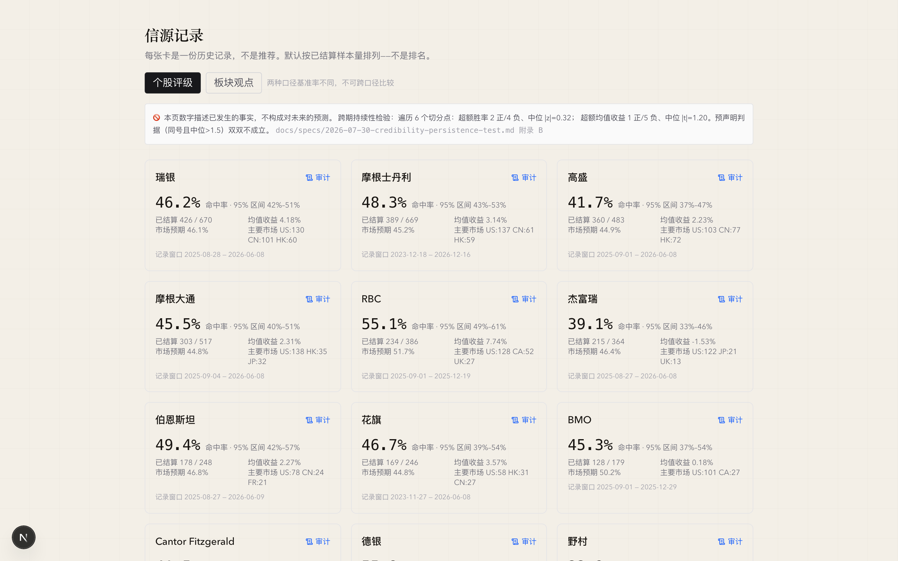
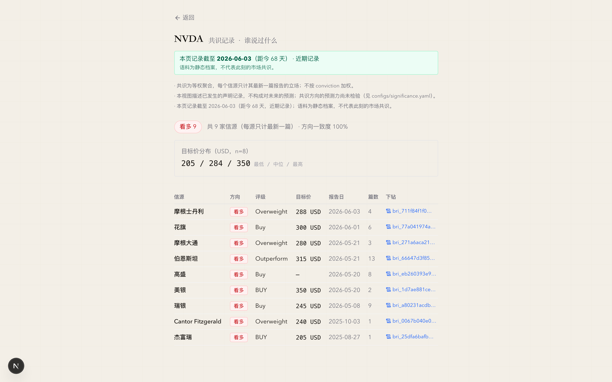
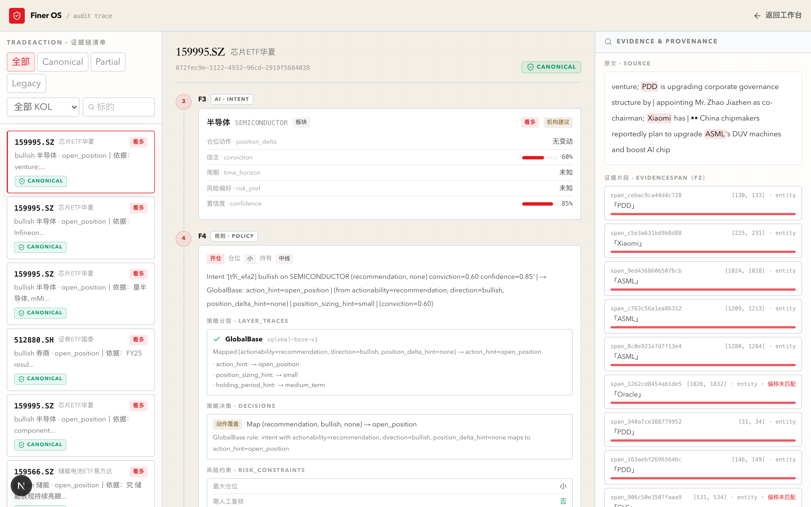

# Finer OS — 谁说过什么，后来发生了什么

**可审计的投研记录系统 · F0–F8**

**中文** · [English](README.en.md)

<p align="center">
  <a href="https://github.com/kelipovanatalja453-bot/finer/actions/workflows/ci.yml"></a>
  
  
  
  
  <a href="https://finer.t800.click"></a>
</p>

> **Finer 不告诉你谁更准。它让你查得清每一句话是谁在什么时候说的、后来发生了什么、以及说的和做的是否一致。**

三条支柱，全部不依赖预测性：

1. **可下钻的记录** — 每个数字 3 次点击内到达原文证据（`EvidenceSpan` 字符区间）
2. **诚实的统计** — 样本不足就说不足，无持续性就说无持续性
3. **言行一致性核查** — 说多做空是可被证据锚定的事实，不需要任何预测性假设

Finer OS 沿 F0–F8 流水线，将财经 KOL 内容与券商研报——聊天记录、图片策略、飞书文档、PDF、音视频转录——统一清洗为标准化内容块，抽取可追溯证据的投资意图，映射为可复核的交易动作，并以完全跟单者口径把每句话对照后来的市场结果，落成可下钻、可审计的历史记录——不构成对未来表现的预测。

[🌐 在线演示](https://finer.t800.click) · [快速开始](#快速开始) · [记录与共识](#记录与共识真实语料上的三个只读视图) · [核心能力](#四个核心能力) · [结算记录](#结算记录收益曲线背后是完整证据链) · [架构设计](#架构设计) · [API 文档](docs/API_REFERENCE.md)

<p align="center">
  <a href="https://finer.t800.click"></a>
  <br>
  <em>KOL 研究视图 — 历史记录卡、累计收益曲线（历史事实）、证据链溯源 · <a href="https://finer.t800.click">🌐 在线体验</a>（演示数据）</em>
</p>

---

## 🌐 在线演示

无需注册、不连后端——打开浏览器即可走一遍完整流程，所有数据均为演示数据。演示工作台为定位转向前的产品形态；产品当前的消费面见[记录与共识](#记录与共识真实语料上的三个只读视图)。

**👉 [finer.t800.click](https://finer.t800.click)**

- **F0 → F8 流水线走查** — 点任一阶段，看一条内容如何逐层变成可溯源的交易动作
- **KOL 研究视图** — 切换 5 个示例 KOL，看历史记录卡、累计收益曲线（附口径声明）与观点列表
- **证据链溯源** — 点一条 `TradeAction`，高亮回溯到原文证据片段与四时钟执行时间
- **回测曲线** — 累计收益、夏普、最大回撤、胜率（历史记录口径，不构成对未来的预测），红涨绿跌
- **RLHF 复核** — 模拟人工裁决，生成 `RLHFFeedback`（演示，不落库）

<p align="center">
  <a href="https://finer.t800.click/demo"></a>
  <br>
  <em>在线演示工作台 — 纯前端模拟，演示数据，不连接真实后端</em>
</p>

---

## 为什么是 Finer

财经创作者与券商分析师把高信号的投资推理，藏在嘈杂的时间轴里：冗长的聊天记录、图片形式的策略帖、飞书文档、研报 PDF、直播转录、碎片化的盘面点评。一个简单的情绪分类器回答不了真正的问题：

> 这句话是谁在什么时候说的？后来市场发生了什么？说的和做的一致吗？

Finer OS 围绕这三个问题构建。它把非结构化内容转成**证据链可追溯**的投资意图，把意图映射为**可复核**的交易动作，再接入时间线分析与回测——每一个结论都能反查到原始出处，每一条记录都如实标注自己的口径与边界。

我们也检验过那个更诱人的问题——「历史表现能否预测未来」。在 2,983 条已结算样本上，两个指标、六个切分点、预先声明的判据，答案双双是否定的：券商的历史超额表现不能预测其未来超额表现。判据先于结果写死在 `scripts/test_credibility_persistence.py`（`CRITERION_*` 常量），结论可复现。我们把这个否定结果公开，并据此把产品定位改成如实记录——诚实的统计不是口号，是先拿自己的前提开刀。

---

## 一条内容，走完 F0 → F8

每一阶段都有冻结的输入/输出契约。原始内容进来，结构化判断出去，中间产物逐层落盘可供人工复核——**不是黑箱**。

```mermaid
flowchart LR
    S0[Raw Sources] --> F0[F0 Intake / ContentRecord]
    F0 --> F1[F1 Standardize / ContentEnvelope]
    F1 --> F15[F1.5 Topic Assembly / TopicBlock]
    F15 --> F2[F2 Anchor / Quality + TemporalAnchor + EvidenceSpan]
    F2 --> F3[F3 Intent / NormalizedInvestmentIntent]
    F3 --> F4[F4 Policy / PolicyMappingResult]
    F4 --> F5[F5 Execute / TradeAction]
    F5 --> F6[F6 Review / Human + RLHF]
    F6 --> F7[F7 Timeline / ViewpointState]
    F7 --> F8[F8 Backtest / Settled Records]
    F8 -.-> FT[F+ Training Loop / SFT + DPO]
```



---

## 记录与共识：真实语料上的三个只读视图

三个只读视图全部消费真实语料：**28,565 份**外资券商研报 PDF（73GB，覆盖 2025-09 ~ 2026-06 约 10 个月窗口的**静态档案**），产出 **4,919 条** canonical `TradeAction`，三向审计 **100%**，挂靠 **128,905 个** evidence span。在宣传站上可直接点开每家信源的冻结快照：[finer.t800.click/records](https://finer.t800.click/records)（2026-08-10 冻结，含每条记录的评级、目标价与结算结果）。

| 视图 | 一句话 | 要点 |
|:---|:---|:---|
| `/discover` 信源记录卡 | 每张卡是一份历史记录，不是推荐 | 默认按已结算样本量排列（稳定输出序，不是排名）；命中率并排 95% 区间；页头持续性检验声明；个股评级 / 板块观点两种口径不混算（口径开关） |
| `/ticker` 个股共识 | 谁说过什么，截至哪一天 | 等权、每源只计最新一篇；目标价最低 / 中位 / 最高；陈旧度横幅置页头；逐行 `intent_id` 下钻；无法诚实聚合时显式拒绝 |
| `/audit` 证据审计 | 每个数字回到原文 | `TradeAction` → F3 意图 → F4 策略 trace → F2 证据片段字符区间 → 原文；`canonical_trace_status` 校验 |

<p align="center">
  
  <br>
  <em>/discover 信源记录卡 — 记录不是排名 · 真实语料 · 2026-08-10 截图</em>
</p>

<p align="center">
  
  <br>
  <em>/ticker 个股共识 — 谁说过什么，截至哪一天 · 真实语料 · 2026-08-10 截图（陈旧度横幅为产品功能）</em>
</p>

<p align="center">
  
  <br>
  <em>/audit 证据审计 — 每个数字回到原文 · 真实语料 · 2026-08-10 截图</em>
</p>

真实案例：NVDA **9 家信源**全 bullish，目标价分布 **205 / 284 / 350 USD**；0700.HK 10 家（HKD 650 / 745 / 800）；**AZN.L 因镑/便士单位混存被显式拒绝聚合目标价**，并保留双方记录可下钻——无法诚实聚合时，产品选择拒绝，而不是给出一个错的数。

陈旧度如实标注：语料是静态档案——中位标的最新报告停在 **2025-12-19**，**70%** 的标的三个月以上无更新，**69%** 只有单一信源。所以 `/ticker` 页头用横幅标注「本页记录截至 X（距今 N 天）」，按 90 / 180 / 365 天分档。负面事实做成产品特性，不藏在脚注。

只读 API：`GET /api/creator/records` · `GET /api/creator/{creator_id}/record` · `GET /api/ticker/{symbol}/consensus` · `GET /api/audit/actions` · `GET /api/audit/actions/{trade_action_id}/trace`

---

## 结算记录：收益曲线背后是完整证据链

<p align="center">
  
  <br>
  <em>累计收益曲线 + 右栏证据链溯源 — 每条 TradeAction 可反查 F3 意图 / F4 策略 / F2 证据（演示数据）</em>
</p>

每条进入回测的 TradeAction 都满足 canonical 契约：可反查到 F3 投资意图、F4 策略映射、F2 证据片段，以及四个明确区分的执行时钟。

- 累计收益、年化、夏普、最大回撤、胜率（历史记录口径）**全部可审计**
- 比率随样本充分性判定呈现：样本不足只报计数，不渲染比率
- 次开盘成交模型 + **显式费用 / 滑点假设**
- `intent_id` / `policy_id` / `evidence_span_ids` 全程贯穿
- 每个数字都可回溯到原始内容；所有比率与曲线均为历史记录，不构成对未来的预测

---

## 四个核心能力

| 阶段 | 能力 | 说明 |
|:---|:---|:---|
| **F0 · F1** | 采集与归一化 | 飞书、B站、券商研报 PDF 等多源内容统一接入（微信公众号为存量归档），标准化为 `ContentEnvelope` + `ContentBlock`，保留来源锚点与原始归档。 |
| **F2** | 锚定证据链 | 实体解析、时间锚定、证据片段（`EvidenceSpan`）抽取。每个判断都能反查到原文的字符区间与来源时间。 |
| **F3 · F4 · F5** | 意图 → 策略 → 执行 | 投资意图提取 → Policy 映射 → 生成 `TradeAction`。每条交易动作携带 `intent_id` / `policy_id` / `evidence_span_ids` 与四时钟执行时间。 |
| **F8** | 回测与结算记录 | 把语言观点对照市场结果，落成可结算、可下钻的记录；所有比率随样本充分性判定呈现，样本不足只报计数，均为历史记录，不构成对未来的预测。 |

---

## AI · 人在环

AI 在每个阶段做**具体可验证**的事。进入回测的硬门是三向审计闭环——`intent` / `policy` / `evidence` 全链 100% 可反查；F6 人工复核按需 / 抽样裁决，裁决以结构化字段记录，导出为 DPO 训练数据——这是 Finer 对「黑箱 AI」最具体的反话术。

<table>
<tr>
<th>🤖 AI 做什么</th>
<th>🧑‍⚖️ 人在哪儿介入</th>
<th>🔄 反馈如何沉淀</th>
</tr>
<tr>
<td valign="top">

- `F1` 视觉/OCR：MiMo-V2.5 处理图片、PDF、截图
- `F1.5` 主题组装：constrained LLM 提议 + 确定性 validator 兜底
- `F3` 投资意图：LLM 从证据片段提取 stance / conviction
- `F5` TradeAction：LLM + 规则共同构造 canonical 动作

</td>
<td valign="top">

`F6` RLHF 复核台。进入回测的硬门是三向审计闭环（`intent_id` / `policy_id` / `evidence_span_ids` 100% 可反查）；人工裁决按需 / 抽样进行：

- 整体 1–5 星评分 + `is_correct` 判断
- 字段级修正：direction / ticker / action chain
- 自由文本备注 + 快捷标签
- `reviewer_id` / `reviewed_at` 全程可审计

</td>
<td valign="top">

- 持久化为 `RLHFFeedback` 记录
- `GET /api/rlhf/export` 导出为 DPO 训练数据
- 第一轮 DPO-LoRA 微调已实跑（小样本方向验证），进展见 [Roadmap](#训练闭环-roadmap)

</td>
</tr>
</table>

```
AI 抽取            人工裁决           结构化记录          导出训练数据
F1–F5 LLM    →    F6 RLHF Panel  →   RLHFFeedback   →   DPO JSONL pairs
                  POST /api/rlhf/submit  →  GET /api/rlhf/export
```

<p align="center">
  
  <br>
  <em>F6 RLHF 复核台 — 待审队列与人工裁决入口</em>
</p>

---

## 训练闭环 Roadmap

我们把训练闭环的**已建成**与**规划中**都摆出来——不夸大。

| | 能力 | 状态 |
|:---:|:---|:---|
| ✅ | **RLHFFeedback 记录** — 人工裁决结构化落库 | 已实现 |
| ✅ | **DPO 数据导出** — `GET /api/rlhf/export` 导出 JSONL pairs | 已实现 |
| ✅ | **模型微调 · 第一轮** — DPO-LoRA 实跑（基座 Qwen3-8B，训练 20 条 registry-验证精选偏好对） | 已实跑：held-out n=29 上偏好胜率 87.1%、编造率 66.7%→22.2%、证据挂靠 33.3%→77.8%（第一轮小样本方向验证，非最终水平） |
| 🔜 | **模型微调 · 扩量第二轮** — 扩大偏好对规模与评测集 | 规划中 |
| 🔜 | **Prompt 工程** — 持续优化各阶段提示词与约束解码 | 规划中 |
| 🔜 | **插件 / 工具调用** — 接入外部金融数据源与工具链 | 规划中 |

> DPO 数据格式、导出 API 与第一轮微调已落地；第一轮为小样本方向验证，非最终水平。Prompt 工程、插件调用与扩量第二轮均为**规划中、尚未实现**。

---

## 各阶段状态

我们更愿意把**已建成**与**未建成**都说清楚。

| Stage | 名称 | 核心 Schema | 状态 |
|:---|:---|:---|:---|
| **F0** | Intake | `ContentRecord` | ✅ implemented |
| **F1** | Standardize | `ContentEnvelope` / `ContentBlock` / `BlockQuality` / `BlockProvenance` | 🟡 alpha（契约重置中） |
| **F1.5** | Topic Assembly | `TopicBlock` / `TopicAssemblyResult` | ✅ wired（规则 fast-path；LLM opt-in） |
| **F2** | Anchor | `QualityCard` / `TemporalAnchor` / `EntityAnchor` / `EvidenceSpan` | 🟠 partial |
| **F3** | Intent | `NormalizedInvestmentIntent` | 🟠 partial |
| **F4** | Policy | `PolicyMappingResult` / `PolicyMappedIntent` | 🟠 partial |
| **F5** | Execute | `TradeAction` / `ExecutionTiming` | 🟠 partial |
| **F6** | Review | `RLHFFeedback` | ✅ implemented |
| **F7** | Timeline | `KOLTimeline` / `ViewpointState` | 🟠 partial |
| **F8** | Backtest | `BacktestResult` | 🟠 partial |
| **F+** | Training | — | ⚪ contract-only |

---

## 工作台即产品

<p align="center">
  
  <br>
  <em>F0–F8 工作台 — 工作流导航、资产网格与证据溯源面板</em>
</p>

---

## 技术栈

| 层级 | 技术选型 | 用途 |
|:---|:---|:---|
| **核心语言** | Python 3.11+ / TypeScript | 后端逻辑 + 前端交互 |
| **Web 框架** | FastAPI + Pydantic V2 | API 服务 + 数据校验 |
| **前端框架** | Next.js 16 + React 19 + TailwindCSS 4 | Dashboard 工作台 |
| **大模型** | MiMo-V2.5 / GLM-5.1 / Qwen | 视觉解析（F1 OCR）+ 富化 + 结构化提取 |
| **结构约束** | Instructor | Contract-first 强类型输出 |
| **数据处理** | Data-Juicer / Polars | 数据清洗 + 回测引擎 |
| **可视化** | ECharts | 收益曲线 + 绩效图表 |
| **RLHF 平台** | 自研 Dashboard | 人工标注 + 偏好收集 |

---

## 快速开始

### 环境要求

- Python 3.11+
- Node.js 18+
- Redis（可选，用于缓存）

### 安装

```bash
# 1. 克隆项目
git clone https://github.com/kelipovanatalja453-bot/finer.git
cd finer

# 2. 安装 Python 依赖
pip install -e .

# 3. 安装前端依赖
cd src/finer_dashboard
npm install
```

### 配置

```bash
# 复制配置模板
cp configs/feishu.yaml.example configs/feishu.yaml

# 设置环境变量
export OPENAI_API_KEY="your-key"
export MIMO_API_KEY="your-key"          # MiMo-V2.5，F1 图片/PDF OCR
export MIMO_BASE_URL="https://token-plan-cn.xiaomimimo.com/v1"  # 仅 tp-* Token Plan key 需要
export DASHSCOPE_API_KEY="your-key"     # 通义千问
export FINANCE_SKILLS_API_KEY="your-key"  # 可选
```

### 运行

```bash
# 启动后端 API（终端 1）
cd src
uvicorn finer.api.server:app --port 8000 --reload

# 启动前端 Dashboard（终端 2）
cd src/finer_dashboard
npm run dev
```

访问 http://localhost:3000 打开 Dashboard。

### 可选：微信视频号 F0 半成品依赖

`POST /api/wechat/channels/import` 依赖 `scripts/wx_channels_download` 的本地 API 或 CLI 获取视频号 profile 和下载视频。该目录随本仓库作为 F0 半成品交接源码保留；运行时产物、DB、日志、私钥与本地构建出的 binary 不应进入版本控制。接手者需先确认该外部项目的授权、构建方式与安全边界。

---

## 架构设计

### 数据流

```
原始内容（KOL + 券商研报）
    ↓
F0 Intake — 多源内容接入（飞书/B站/券商研报 PDF；微信为存量归档），统一写入 ContentRecord
    ↓
F1 Standardize — 内容块标准化（ContentEnvelope / ContentBlock + standardization quality + provenance）
    ↓
F1.5 Topic Assembly — 长聊天/长文档语义主题组装（TopicBlock / TopicAssemblyResult）
    ↓
F2 Anchor — 质量评估 + 时间锚 + 证据跨度（QualityCard / TemporalAnchor / EvidenceSpan）
    ↓
F3 Intent — 投资意图抽取（direction / actionability / position_delta_hint / conviction）
    ↓
F4 Policy — 策略映射 hint（GlobalBase → StyleArchetype → KOLPersona）
    ↓
F5 Execute — 可追溯 TradeAction + ExecutionTiming（intent_id + policy_id + evidence_span_ids）
    ↓
F6 Review + F7 Timeline — 人工复核、观点状态机、时间线分析
    ↓
F8 Backtest — 跟随交易模拟与历史结算记录
    ↓
F+ Training Loop — SFT / DPO / RLHF 模型改进（跨阶段闭环，contract-only）
```

### 核心模块

| F-Stage | 模块 | 职责 | 关键文件 |
|:---|:---|:---|:---|
| **F0** | 接入层 | 多源数据导入 | `ingestion/feishu_poller.py` |
| **F1** | 标准化层 | 内容容器、质量卡、证据链 | `schemas/content_envelope.py`, `schemas/quality.py` |
| **F1.5** | 主题组装层 | 长聊天/长文档拆分为 TopicBlock | `schemas/topic_block.py`, `parsing/topic_assembler.py` |
| **F2** | 锚定层 | TemporalAnchor 时间解析、EvidenceSpan 锚定 | `schemas/temporal.py` |
| **F3** | 意图层 | 投资意图抽取（四轴输出） | `schemas/investment_intent.py`, `extraction/intent_extractor.py` |
| **F4** | 策略层 | Policy 映射（hint，不生成 TradeAction） | `policy/policy_mapper.py`, `schemas/policy.py` |
| **F5** | 执行层 | Canonical TradeAction + ExecutionTiming 生成 | `extraction/action_composer.py`（canonical 唯一构造点；`trade_action_extractor.py` 为已隔离 legacy） |
| **F6** | 复核层 | 人工校准、RLHF | `api/routes/rlhf.py` |
| **F7** | 时间线层 | ViewpointState、KOL 观点演化 | `timeline/` |
| **F8** | 回测层 | 跟随交易模拟与历史结算记录 | `backtest/` |

完整架构见 [docs/ARCHITECTURE.md](docs/ARCHITECTURE.md)。

---

## API 文档

详细参考见 [docs/API_REFERENCE.md](docs/API_REFERENCE.md)。

| 端点 | 方法 | 用途 |
|:---|:---|:---|
| `/api/creator/records` | GET | 信源记录卡列表（默认按已结算样本量排列，附样本充分性判定） |
| `/api/creator/{creator_id}/record` | GET | 单一信源的历史记录卡 |
| `/api/ticker/{symbol}/consensus` | GET | 个股共识（等权、每源只计最新一篇、陈旧度标注） |
| `/api/audit/actions` | GET | 可审计 TradeAction 列表 |
| `/api/audit/actions/{trade_action_id}/trace` | GET | 单条动作的 F3 意图 / F4 策略 / F2 证据链 trace |
| `/api/files` | GET | 获取资产列表 |
| `/api/enrichment/split` | POST | 话题分割/锚定（legacy API name，对应 F1.5/F2） |
| `/api/enrichment/extract` | POST | 实体抽取 |
| `/api/review/save` | POST | 保存复核结果 |
| `/api/rlhf/submit` | POST | 提交 RLHF 反馈 |
| `/api/rlhf/export` | GET | 导出 DPO 训练数据 |

---

## 开发指南

### 项目结构

```
src/finer/
├── api/              # FastAPI 路由
│   ├── routes/       # 各模块端点
│   └── server.py     # 应用入口
├── enrichment/       # F2 锚定层
├── extraction/       # F3/F5 抽取层
├── ingestion/        # F0 数据接入
├── parsing/          # F1 标准化 + F1.5 主题组装
├── policy/           # F4 策略映射
├── backtest/         # F8 回测引擎
├── timeline/         # F7 时间线引擎
├── schemas/          # Pydantic 模型（唯一真相源）
└── services/         # 外部服务

src/finer_dashboard/  # Next.js 16 Dashboard
```

### 常用命令

```bash
# 运行测试
pytest tests/ -v

# 前端构建 / 类型检查
cd src/finer_dashboard && npm run build
cd src/finer_dashboard && npx tsc --noEmit
```

---

## 贡献指南

欢迎贡献代码、报告问题或提出建议。

1. Fork 本仓库
2. 创建特性分支（`git checkout -b feature/amazing-feature`）
3. 提交更改（`git commit -m 'feat: add amazing feature'`）
4. 推送并创建 Pull Request

请确保：代码通过 `pytest`、遵循 `black` 格式规范、新功能有对应测试。

---

## 许可证

本项目采用 [MIT License](LICENSE) 开源协议。

## 致谢

本项目受以下开源项目启发：
[Instructor](https://github.com/jxnl/instructor)（结构化输出）·
[Data-Juicer](https://github.com/modelscope/data-juicer)（数据清洗）·
[Argilla](https://github.com/argilla-io/argilla)（RLHF 标注）·
[MinerU](https://github.com/opendatalab/MinerU)（文档解析）

---

> ⚠️ **免责声明**：Finer OS 是内部研究系统原型。数据与回测结果（含本页截图中的收益数字）均为示例或历史记录，仅供研究，**不构成任何投资建议**。本平台未观测到信源历史表现的跨期持续性；所有比率与曲线均为历史记录，不构成对未来的预测。
