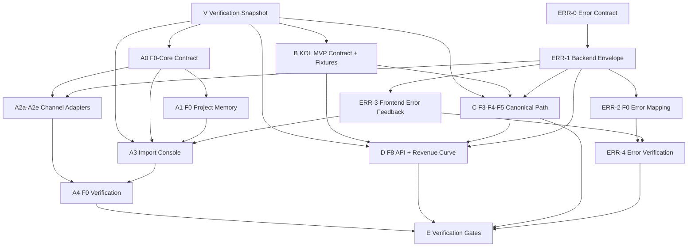

# 2026-05 Parallel Agent Execution Spec

> Status: active planning spec
> Created: 2026-05-11
> Scope: Finer OS 5 月并行开发规范
> Canonical architecture: F0-F8 only. Do not introduce deprecated legacy stage names in new work.

## 1. Mission

5 月剩余开发窗口的目标不是补完整个 Finer OS，而是并行推进两类工作：

1. **F0 Intake Repair + Project Memory + Import Console**：修复多渠道原始数据导入，建立可持续本地索引，避免每次打开 Finer OS 都全量扫描。
2. **KOL Backtest MVP**：让至少一个 KOL 的真实或固化样本走通 canonical 路径，并生成可展示的收益图。

所有并行 agent 必须以本文档为执行边界。任何任务开始前必须声明：

- 所属 parallel line
- 所属 F-stage
- 输入 schema
- 输出 schema
- 允许修改文件
- 禁止修改文件
- 验收命令

## 2. Global Rules

### 2.1 One Agent, One Ownership Boundary

实现型 agent 必须满足以下任一条件：

- 只负责一个 F-stage 的 owning files。
- 只负责一个明确的 frontend surface。
- 只负责只读 verification。

禁止一个实现型 agent 同时修改 F0 channel adapter、F3 extractor、F8 backtest 和 dashboard。跨 stage 集成必须通过 schema artifact 交接。

### 2.2 Shared Contract First

共享 contract 必须先冻结，再允许下游并行。

共享 contract 包括：

- `ContentRecord`
- raw archive path rule
- dedupe key rule
- import run / status / error model
- local project memory index contract
- `BacktestResult` / `portfolio_snapshots` 前后端字段

渠道 agent 不得私自给 `ContentRecord` 加字段。确需新增字段时，只能走 F0-Core contract 变更，并优先采用 optional additive field。

### 2.3 No Cross-Stage Business Logic

禁止事项：

- F0 不做 OCR、markdown 解析、topic assembly、entity/time anchor、intent、TradeAction、backtest。
- F1 不做 topic assembly 或 investment intent。
- F1.5 不解析 F1 原始格式细节。
- F2 不生成 Intent、Policy 或 TradeAction。
- F3 不生成 TradeAction、仓位比例、目标价、止损止盈。
- F4 不生成 TradeAction，不修改 F3 direction。
- F5 不从原始文本直接生成 canonical TradeAction。
- F8 不生成 TradeAction，不回测缺少 `execution_timing` 的 action。

### 2.4 Legacy Path Is Not A Main Path

`TradeActionExtractor.extract_from_text()` 只能作为 legacy baseline 或对照实验。任何新主链路、API、dashboard、回测入口都不得依赖它作为 canonical 输入。

Canonical F5 `TradeAction` 必须包含：

- `intent_id`
- `policy_id`
- `evidence_span_ids`
- `execution_timing`

`ExecutionTiming` 必须区分：

- `intent_published_at`
- `intent_effective_at`
- `action_decision_at`
- `action_executable_at`

### 2.5 Data And Database Red Lines

以下操作必须先获得用户确认：

- 删除文件、目录或历史数据。
- 修改 `.env`、密钥、token、CI/CD 配置。
- 新增或修改 SQLite 表结构。
- 旧数据迁移、批量重建、批量删除。
- `git push`、`git rebase`、`git reset --hard`、强制推送。

F0 Project Memory 可以先写 contract 和测试计划。真正落地 SQLite schema 或迁移脚本前必须单独确认。

### 2.6 Worktree Isolation

多 agent 并行写代码时，优先使用独立 git worktree 或独立分支。不能让两个实现型 agent 在同一个工作目录同时修改重叠文件。

推荐分支前缀：

```bash
codex/f0-core-memory
codex/f0-feishu-intake
codex/f0-local-intake
codex/f0-nlm-intake
codex/f0-wechat-intake
codex/f0-bilibili-intake
codex/f0-import-console
codex/error-feedback-foundation
codex/kol-backtest-mvp
codex/f3-f4-f5-canonical
codex/f8-backtest-chart
codex/verification-snapshot
codex/verification-gates
```

## 3. Parallel Lines

### Line V: Verification Snapshot

**Mission**

在任何新一轮实现型 agent 开工前，先固化当前项目状态，形成只读 baseline report。Line V 不修复问题，只报告测试结果、worktree 状态、package lock 一致性、deprecated-path/mock/contract-only 缺口，以及后续 agent 的 ownership 冲突。

**Type**: cross-stage read-only gate

**Spec and prompt**

详见 `docs/specs/2026-05-verification-snapshot-gate.md`。

**Allowed behavior**

- read files
- run tests and build/type-check commands
- run `rg`, `git status`, `git diff`, `git log`, and lockfile consistency checks
- report file/line evidence and recommended owner

**Forbidden behavior**

- no file edits
- no `apply_patch`
- no source/doc/test/package/data changes
- no git stage/commit/push/rebase/reset
- no database schema creation, migration, rebuild, or data mutation
- no cleanup of generated files

**Output**

Final response only:

- gate result: `PASS`, `WARN`, or `BLOCKED`
- command result table
- current worktree snapshot
- findings table by severity
- parallel readiness table for B1, C1, D1, D2, A1, and F
- next actions

### Line A: F0 Intake Repair + Project Memory + Import Console

**Mission**

修复并完善飞书、本地上传、NotebookLM、微信、B站的数据导入能力，并建立 F0 项目内存系统，使 Finer OS 能快速加载、持续增量更新，避免每次打开时全量扫描。

**Boundary**

F0 only outputs:

- `ContentRecord`
- raw archive
- F0 import receipt / run status
- F0 local project memory index

F0 must not output:

- `ContentEnvelope`
- `TopicBlock`
- `EvidenceSpan`
- `NormalizedInvestmentIntent`
- `PolicyMappingResult`
- `TradeAction`
- `BacktestResult`

#### A0. F0-Core Contract

**F-stage**: F0

**Purpose**

冻结所有渠道共享的 F0 契约。

**Allowed files**

- `src/finer/schemas/content.py`
- `src/finer/ingestion/orchestrator.py`
- `src/finer/ingestion/receipt.py`
- `src/finer/manifests.py`
- `src/finer/paths.py`
- `src/finer/api/routes/files.py`
- F0 contract tests under `tests/`
- F0 docs under `docs/specs/`

**Forbidden files**

- `src/finer/parsing/**`
- `src/finer/enrichment/**`
- `src/finer/extraction/**`
- `src/finer/policy/**`
- `src/finer/backtest/**`
- `src/finer_dashboard/**`

**Output contract**

- stable `ContentRecord`
- raw archive path rule
- dedupe key rule
- import status and error model
- artifact location rule
- rebuild/index health semantics

#### A1. F0-Project Memory / Local Storage

**F-stage**: F0

**Purpose**

建立 F0 项目内存索引，让 Import Console 和 F1 routing 可以快速查询 F0 records，而不是启动时递归扫描 raw directories。

**Storage model**

- raw 文件是不可变原始档案。
- `ContentRecord` JSON / manifest 是可重建依据。
- SQLite 是热索引，不是唯一真相源。
- index 缺失、版本过期或用户手动 rebuild 时才全量扫描。
- 增量导入必须立即更新 index。

**Index scope**

Allowed in F0 project memory:

- content records
- raw assets
- import runs
- source channels
- source cursors
- dedupe fingerprints
- artifact locations
- index metadata

Forbidden in F0 project memory:

- F1 `ContentEnvelope`
- F1.5 `TopicBlock`
- F2 anchors/evidence
- F3 intents
- F4 policy results
- F5 trade actions
- F8 backtest results

**Performance acceptance**

- Finer OS startup must not recursively scan raw data directories by default.
- Import Console initial load must read F0 index.
- 10k `ContentRecord` records first page query target: <= 500ms on local dev machine.
- Full rebuild must be explicit or background, not startup behavior.
- Index health must be visible to frontend.

**Red line**

Actual SQLite schema creation or data migration requires user confirmation before implementation.

**Allowed files for first-round contract work**

- `docs/specs/**`
- `src/finer/schemas/content.py`
- `src/finer/ingestion/receipt.py`
- `src/finer/manifests.py`
- `src/finer/paths.py`
- `src/finer/api/routes/files.py`
- F0 project memory tests under `tests/`

**Forbidden files**

- `src/finer/parsing/**`
- `src/finer/enrichment/**`
- `src/finer/extraction/**`
- `src/finer/policy/**`
- `src/finer/backtest/**`
- `data/**`
- SQLite migration scripts or generated database files unless separately approved by the user

**First-round deliverables**

- Project memory contract: indexable fields, query shape, health status, rebuild states.
- Explicit startup rule: startup reads index metadata first and never performs recursive raw scan by default.
- API response contract for Import Console index health.
- Test plan or contract tests that can run without creating or migrating a production database.

**Recommended commands**

```bash
pytest tests/test_errors.py -q
rg -n "rglob|os\\.walk|glob\\(" src/finer/api src/finer/ingestion src/finer/manifests.py
rg -n "sqlite|CREATE TABLE|ALTER TABLE|migration" src/finer tests docs/specs/2026-05-parallel-agent-execution.md
```

#### A2. F0-Channel Adapters

**F-stage**: F0

Channel tasks may run in parallel after A0 contract is accepted.

| Channel | Primary files | Output |
|---|---|---|
| Feishu | `src/finer/ingestion/feishu_poller.py`, relevant integration route | raw archive + `ContentRecord` + import receipt |
| Local upload | `src/finer/api/routes/files.py`, F0 upload helper | raw archive + `ContentRecord` |
| NotebookLM | `src/finer/ingestion/nlm_sync.py`, integration route | raw archive + `ContentRecord` |
| WeChat | `src/finer/ingestion/wechat_adapter.py`, `src/finer/ingestion/wechat_exporter_client.py`, `src/finer/api/routes/wechat.py` | article/video raw artifacts + `ContentRecord` |
| Bilibili | `src/finer/ingestion/bilibili_adapter.py`, `src/finer/api/routes/bilibili.py` | video/audio/subtitle raw artifacts + `ContentRecord` |

Every channel must preserve:

- external source id if available
- source url if available
- source platform
- creator id/name if known
- published time if known
- collected time
- raw file path
- channel metadata
- dedupe fingerprint
- import error details

Channel adapters must not call F1-F8 logic.

**Shared channel rules**

- Each channel agent owns one source adapter and its route tests.
- Shared helpers and schema changes must go through A0/A1 instead of being changed independently.
- `src/finer/api/routes/integrations.py` is a conflict-prone file. Only one channel agent may edit it at a time, or the route must be split before parallel edits.
- Channel agents must use Line F error envelope for all new or changed failures.
- Channel agents must not change frontend files unless explicitly assigned A3.

#### A2a. F0-Feishu Intake

**Allowed files**

- `src/finer/ingestion/feishu_poller.py`
- Feishu-specific integration route or route tests
- Feishu fixtures under `tests/fixtures/`

**Output**

- raw archive
- `ContentRecord`
- import receipt
- Line F error details with `source_channel=feishu`

**Recommended commands**

```bash
pytest tests -q -k "feishu or f0"
rg -n "from finer\\.(parsing|enrichment|extraction|policy|backtest)|TradeAction|Backtest" src/finer/ingestion/feishu_poller.py
```

#### A2b. F0-Local Upload

**Allowed files**

- `src/finer/api/routes/files.py`
- local upload helper modules if already present
- local upload tests and fixtures

**Output**

- raw archive
- `ContentRecord`
- import receipt
- dedupe result
- Line F error details with `source_channel=local`

**Recommended commands**

```bash
pytest tests -q -k "files or upload or f0"
rg -n "from finer\\.(parsing|enrichment|extraction|policy|backtest)|TradeAction|Backtest" src/finer/api/routes/files.py
```

#### A2c. F0-NotebookLM Intake

**Allowed files**

- `src/finer/ingestion/nlm_sync.py`
- NotebookLM-specific integration route or route tests
- NotebookLM fixtures under `tests/fixtures/`

**Output**

- raw archive
- `ContentRecord`
- import receipt
- Line F error details with `source_channel=nlm`

**Recommended commands**

```bash
pytest tests -q -k "nlm or notebook or f0"
rg -n "from finer\\.(parsing|enrichment|extraction|policy|backtest)|TradeAction|Backtest" src/finer/ingestion/nlm_sync.py
```

#### A2d. F0-WeChat Intake

**Allowed files**

- `src/finer/ingestion/wechat_adapter.py`
- `src/finer/ingestion/wechat_exporter_client.py`
- `src/finer/api/routes/wechat.py`
- WeChat tests and fixtures

**Output**

- article/video raw artifacts
- `ContentRecord`
- import receipt
- Line F error details with `source_channel=wechat`

**Recommended commands**

```bash
pytest tests/test_wechat_content_record.py tests/test_wechat_artifact_store.py tests/test_wechat_api_routes.py -q
rg -n "from finer\\.(parsing|enrichment|extraction|policy|backtest)|TradeAction|Backtest" src/finer/ingestion/wechat_adapter.py src/finer/ingestion/wechat_exporter_client.py src/finer/api/routes/wechat.py
```

#### A2e. F0-Bilibili Intake

**Allowed files**

- `src/finer/ingestion/bilibili_adapter.py`
- `src/finer/api/routes/bilibili.py`
- Bilibili tests and fixtures

**Output**

- video/audio/subtitle raw artifacts
- `ContentRecord`
- import receipt
- Line F error details with `source_channel=bilibili`

**Recommended commands**

```bash
pytest tests/test_bilibili.py -q
rg -n "from finer\\.(parsing|enrichment|extraction|policy|backtest)|TradeAction|Backtest" src/finer/ingestion/bilibili_adapter.py src/finer/api/routes/bilibili.py
```

#### A3. F0-Frontend Import Console

**Surface**: F0 frontend

**Purpose**

设计并实现数据源/导入中心。它展示导入状态，不展示解析或回测结果。

**Allowed files**

- `src/finer_dashboard/src/components/data-source-config/**`
- `src/finer_dashboard/src/app/settings/**`
- `src/finer_dashboard/src/app/api/files/**`
- `src/finer_dashboard/src/app/api/sources/**`
- `src/finer_dashboard/src/lib/contracts.ts`
- `src/finer_dashboard/src/lib/api-client.ts` if needed

**Forbidden behavior**

- 不展示 F1/F2/F3 解析结果。
- 不生成收益图。
- 不调用 extraction/backtest API。
- 不把 "imported" 显示成 "processed"。
- 不在前端做 dedupe 业务判断，只展示后端结果。

**Required UI concepts**

- source channel status
- import history
- failures and retryable errors
- raw asset list
- `ContentRecord` details
- dedupe status
- project memory index health
- explicit rebuild trigger placeholder

**Error UI requirements**

- Display `error.code`, `request_id`, `retryable`, and `fix_hint`.
- Do not display raw exception messages, tokens, cookies, request headers, or auth values.
- Retry buttons must call the F0 retry/import endpoint only. They must not trigger F1-F8 processing.

**Recommended commands**

```bash
cd src/finer_dashboard && npm run build
cd src/finer_dashboard && npx tsc --noEmit
rg -n "backtest|extract|TradeAction|processed" src/finer_dashboard/src/components/data-source-config src/finer_dashboard/src/app/settings
rg -n "requestId|request_id|fixHint|fix_hint|retryable|error\\.code" src/finer_dashboard/src
```

#### A4. F0-Verification

**Type**: read-only verification

Checks:

- Each channel outputs only F0 artifacts.
- F0 code does not import parsing/extraction/policy/backtest modules.
- Import Console uses F0 APIs only.
- Cold start path uses index, not full recursive raw scan.
- Dedupe prevents duplicate `ContentRecord` creation.
- Rebuild behavior is explicit.

Recommended commands:

```bash
pytest tests/test_wechat_content_record.py tests/test_wechat_artifact_store.py tests/test_wechat_api_routes.py tests/test_bilibili.py tests/test_f1_standardization_router.py -q
rg -n "from finer\\.(parsing|enrichment|extraction|policy|backtest)|import finer\\.(parsing|enrichment|extraction|policy|backtest)" src/finer/ingestion src/finer/api/routes/files.py
rg -n "extract_from_text|TradeAction|Backtest" src/finer/ingestion src/finer_dashboard/src/components/data-source-config src/finer_dashboard/src/app/settings
```

### Line B: KOL Backtest MVP Contract + Golden Fixtures

**Mission**

冻结一个 KOL 从内容到收益图的最小验收合同。

**Outputs**

- KOL sample selection
- golden F1/F1.5/F2/F3/F4/F5/F8 artifacts
- end-to-end smoke fixture
- expected revenue curve fields

**Allowed files**

- `tests/fixtures/kol/**`
- `tests/test_*kol*`
- `docs/specs/**`

**Forbidden behavior**

- 不改 business implementation。
- 不用 legacy direct extraction 定义 MVP 成功。

### Line C: F3-F4-F5 Canonical Action Path

**Mission**

打通 F3 Intent -> F4 Policy -> F5 canonical TradeAction。

**Owning files**

- `src/finer/extraction/intent_extractor.py`
- `src/finer/schemas/investment_intent.py`
- `src/finer/policy/**`
- `src/finer/schemas/policy.py`
- `src/finer/extraction/canonical_action_builder.py`
- `src/finer/extraction/trade_action_extractor.py` only for deprecation boundaries and canonical entry points
- related tests

**Acceptance**

- Every canonical `TradeAction` has non-empty `intent_id`.
- Every canonical `TradeAction` has non-empty `policy_id`.
- Every canonical `TradeAction` has at least one `evidence_span_id`.
- Every canonical `TradeAction` has `execution_timing`.
- New main path does not call `extract_from_text()`.

Recommended commands:

```bash
pytest tests/test_canonical_f3_f4_f5_contract.py tests/test_canonical_action_builder.py tests/test_intent_extractor_canonical.py tests/test_policy_mapper.py -q
rg -n "extract_from_text\\(" src/finer tests
```

### Line D: F8 Backtest API + Revenue Curve

**Mission**

让 F8 接收 canonical TradeAction，输出 `BacktestResult + portfolio_snapshots`，并在前端展示收益曲线。

**Backend owning files**

- `src/finer/backtest/**`
- `src/finer/api/routes/backtest.py`
- F8 tests

**Frontend owning files**

- `src/finer_dashboard/src/app/kol/[id]/backtest/page.tsx`
- `src/finer_dashboard/src/app/backtest/page.tsx`
- `src/finer_dashboard/src/lib/contracts.ts`
- dashboard chart component files if introduced

**Acceptance**

- F8 rejects or skips actions without `execution_timing` / executable time.
- Production path does not silently use mock prices.
- API returns metrics and portfolio snapshots.
- Frontend revenue curve uses API snapshots, not hard-coded mock data.
- Backtest result persists to `data/F8_metrics/`.

### Line E: Verification Gates

**Mission**

只读验证所有并行线是否符合 contract。

**Allowed behavior**

- read files
- run tests
- report findings
- propose fixes

**Forbidden behavior**

- no business code edits
- no schema edits
- no data deletion
- no migration

Verification must cover:

- F-stage boundary violations
- legacy extraction usage
- schema serialization
- F0 cold-start/index path
- F8 backtest readiness
- frontend mock leakage
- Line F error envelope usage

Recommended commands:

```bash
pytest tests/test_errors.py -q
pytest tests/test_wechat_content_record.py tests/test_wechat_artifact_store.py tests/test_wechat_api_routes.py tests/test_bilibili.py -q
pytest tests/test_canonical_f3_f4_f5_contract.py tests/test_canonical_action_builder.py tests/test_intent_extractor_canonical.py tests/test_policy_mapper.py -q
rg -n "extract_from_text\\(" src/finer tests
rg -n "return \\{.*\"error\"|HTTPException\\(status_code=.*detail=\"" src/finer/api/routes src/finer/ingestion
rg -n "from finer\\.(parsing|enrichment|extraction|policy|backtest)|import finer\\.(parsing|enrichment|extraction|policy|backtest)" src/finer/ingestion src/finer/api/routes/files.py
rg -n "mock|hard-coded|hardcoded|sampleData|demoData" src/finer_dashboard/src/app/kol src/finer_dashboard/src/app/backtest src/finer_dashboard/src/components
cd src/finer_dashboard && npm run build
```

### Line F: Error Feedback Foundation

**Mission**

让所有并行 agent 在开发 F0 / F3-F5 / F8 / 前端时，遇到错误都能返回稳定 error_code、request_id、stage、operation、source_channel、retryable 和可读修复提示。

**First-round scope**

- Preserve the existing `src/finer/errors/` structure.
- Add a thin canonical details layer, route mapping guidance, frontend display contract, and tests.
- Do not add an error history database, observability platform, new queue, or schema migration in the first round.
- Do not attempt to migrate every historical route at once. New or touched routes must comply; untouched legacy responses are reported by verification.

#### Canonical Error Envelope

所有 API 错误响应必须遵循：

```json
{
  "ok": false,
  "error": {
    "code": "F0_EXT_001",
    "message": "微信导出器不可达",
    "details": {
      "request_id": "req-xxx",
      "stage": "F0",
      "operation": "wechat_import",
      "source_channel": "wechat",
      "content_id": "optional",
      "import_run_id": "optional",
      "external_source_id": "optional",
      "retryable": true,
      "fix_hint": "启动 exporter 并验证 exporter_url",
      "exception_type": "optional"
    }
  }
}
```

#### Required Fields

| 字段 | 类型 | 必须 | 说明 |
|------|------|------|------|
| request_id | string | 是 | 自动生成，贯穿请求生命周期 |
| stage | string | 是 | F0/F1/F2/.../F8/cross |
| operation | string | 是 | 操作标识，如 wechat_import、bilibili_sync |
| source_channel | string | 否 | 数据源渠道：wechat/bilibili/feishu/nlm/local |
| retryable | boolean | 是 | 是否可重试 |
| fix_hint | string | 是 | 人类可读的修复建议 |
| content_id | string | 否 | 关联的内容 ID |
| import_run_id | string | 否 | 导入批次 ID |
| external_source_id | string | 否 | 外部系统 ID |
| exception_type | string | 否 | Python 异常类名（调试用） |

#### Sensitive Field Filtering

details 中不得出现：

- token, secret, password, cookie, authorization, api_key

#### F0 Error Code Registry

| Code | 含义 | retryable |
|------|------|-----------|
| F0_AUTH_001 | 认证/会话失效 | true |
| F0_EXT_001 | 外部服务不可达 | true |
| F0_EXT_002 | 外部返回异常数据 | false |
| F0_IO_001 | raw 文件写入失败 | true |
| F0_STATE_001 | cursor/session 状态异常 | true |
| F0_TMO_001 | 操作超时 | true |

#### ERR-0. Contract And Documentation

**Type**: cross-stage documentation

**Allowed files**

- `docs/specs/2026-05-parallel-agent-execution.md`
- `CLAUDE.md`
- `src/finer/errors/README.md`
- `src/finer/errors/RUNBOOK.md`

**Forbidden files**

- business implementation files
- frontend implementation files
- tests, unless the task explicitly asks for doc examples to become executable tests

**Deliverables**

- Canonical details field list.
- Sensitive field filtering rule.
- F0 route mapping table.
- Agent task cards for ERR-1 to ERR-4.

**Recommended commands**

```bash
rg -n "request_id|stage|operation|source_channel|retryable|fix_hint" docs/specs/2026-05-parallel-agent-execution.md CLAUDE.md src/finer/errors/README.md src/finer/errors/RUNBOOK.md
git diff --check
```

#### ERR-1. Backend Error Envelope Thin Layer

**Type**: backend infrastructure

**Allowed files**

- `src/finer/errors/exceptions.py`
- `src/finer/errors/handler.py`
- `src/finer/errors/__init__.py`
- `tests/test_errors.py`

**Forbidden files**

- F0/F1/F2/F3/F4/F5/F8 business modules
- dashboard files
- database schema or migration files

**Implementation requirements**

- Keep the API payload shape: `{"ok": false, "error": {"code", "message", "details"}}`.
- Ensure `request_id` is present in details.
- Provide or preserve helpers for `stage`, `operation`, `source_channel`, `retryable`, and `fix_hint`.
- Filter sensitive detail keys before serialization.
- Preserve debug gating for raw exception messages.

**Recommended commands**

```bash
pytest tests/test_errors.py -q
rg -n "token|secret|password|cookie|authorization|api_key" src/finer/errors tests/test_errors.py
```

#### ERR-2. F0 Error Mapping

**Type**: F0 backend mapping

**Allowed files**

- `src/finer/api/routes/files.py`
- `src/finer/api/routes/integrations.py`
- `src/finer/api/routes/wechat.py`
- `src/finer/api/routes/bilibili.py`
- `src/finer/ingestion/wechat_adapter.py`
- `src/finer/ingestion/bilibili_adapter.py`
- `src/finer/ingestion/feishu_poller.py`
- `src/finer/ingestion/nlm_sync.py`
- route/adapter tests for touched files

**Forbidden files**

- `src/finer/parsing/**`
- `src/finer/enrichment/**`
- `src/finer/extraction/**`
- `src/finer/policy/**`
- `src/finer/backtest/**`
- dashboard files

**Mapping rules**

| Failure | Preferred code | Required details |
|---|---|---|
| auth/session invalid | `F0_AUTH_001` or specific integration auth code | `stage=F0`, `operation`, `source_channel`, `retryable=true` |
| external source unavailable | `F0_EXT_001` | `stage=F0`, `operation`, `source_channel`, `retryable=true` |
| invalid external data | `F0_EXT_002` | `stage=F0`, `operation`, `source_channel`, `retryable=false` |
| raw artifact write failed | `F0_IO_001` | `stage=F0`, `operation`, `source_channel`, `retryable=true` |
| cursor/session state invalid | `F0_STATE_001` | `stage=F0`, `operation`, `source_channel`, `retryable=true` |
| timeout | `F0_TMO_001` | `stage=F0`, `operation`, `source_channel`, `retryable=true` |

**Recommended commands**

```bash
pytest tests/test_wechat_api_routes.py tests/test_bilibili.py tests/test_wechat_content_record.py -q
rg -n "return \\{.*\"error\"|HTTPException\\(status_code=.*detail=\"" src/finer/api/routes src/finer/ingestion
rg -n "stage=.*F0|source_channel|retryable|fix_hint" src/finer/api/routes src/finer/ingestion tests
```

#### ERR-3. Frontend Error Feedback

**Type**: dashboard contract and UI

**Allowed files**

- `src/finer_dashboard/src/lib/contracts.ts`
- `src/finer_dashboard/src/lib/api-client.ts`
- `src/finer_dashboard/src/components/error-panel/**`
- `src/finer_dashboard/src/components/data-source-config/**`
- focused frontend tests if present

**Forbidden files**

- backend business modules
- F1-F8 pipeline modules
- unrelated dashboard pages

**Requirements**

- Expose `code`, `message`, `requestId`, `details`, `fixHint`, and `retryable` in the frontend error type.
- Import Console must show code, request id, fix hint, and retry state.
- Do not render sensitive raw details or Python tracebacks.

**Recommended commands**

```bash
cd src/finer_dashboard && npm run build
cd src/finer_dashboard && npx tsc --noEmit
rg -n "requestId|request_id|fixHint|fix_hint|retryable|error\\.code" src/finer_dashboard/src
```

#### ERR-4. Error Verification Gate

**Type**: read-only verification

**Allowed behavior**

- read files
- run tests
- report route gaps and sensitive detail risks

**Forbidden behavior**

- no implementation edits
- no schema edits
- no database changes
- no data deletion

**Recommended commands**

```bash
pytest tests/test_errors.py -q
rg -n "return \\{.*\"error\"|HTTPException\\(status_code=.*detail=\"" src/finer/api/routes src/finer/ingestion
rg -n "token|secret|password|cookie|authorization|api_key" src/finer/errors src/finer/api/routes src/finer/ingestion
rg -n "request_id|fix_hint|retryable|source_channel|stage" src/finer src/finer_dashboard/src
```

## 4. Dependency Graph



## 5. Artifact Handoff Rules

Agents exchange artifacts through files, not private assumptions.

| Producer | Artifact | Consumer |
|---|---|---|
| V | verification snapshot baseline report | all implementation agents |
| A0 | F0 contract doc / schema tests | A1, A2, A3 |
| A1 | F0 index contract / project memory health model | A3, A4 |
| A2a-A2e | channel-specific `ContentRecord` fixtures | A4, future F1 |
| B | golden artifacts | C, D, E |
| C | canonical `TradeAction` fixtures | D, E |
| D | `BacktestResult` fixture + snapshots | E |
| ERR-0 | canonical error envelope contract | ERR-1, ERR-2, ERR-3, ERR-4 |
| ERR-1 | backend error helper and handler contract | ERR-2, ERR-3, ERR-4 |
| ERR-2 | F0 route/adapter error mapping | A2a-A2e, A3, E |
| ERR-3 | frontend error display contract | A3, E |

Every artifact must be JSON serializable and traceable to upstream ids.

## 6. Review Checklist For Any Parallel Agent

Before starting:

- [ ] Read `AGENTS.md`.
- [ ] Read this document.
- [ ] Declare parallel line and F-stage.
- [ ] List allowed and forbidden files.
- [ ] Confirm whether the task touches database schema or migration.
- [ ] Confirm no other active agent owns the same files.
- [ ] Confirm whether the task touches shared routes such as `integrations.py` or `contracts.ts`.

Before finalizing:

- [ ] Run relevant tests or explain why not.
- [ ] Run `git status --short`.
- [ ] Report files changed.
- [ ] Report contract impact.
- [ ] Report verification commands and results.
- [ ] Report open issues.
- [ ] Report any remaining non-canonical error envelopes or raw `HTTPException` gaps.

## 7. Current P0 Ordering

1. Freeze this parallel execution spec and sync mandatory rules into `CLAUDE.md`.
2. Run Line V Verification Snapshot and use its report as the baseline for all implementation agents.
3. Freeze Error Feedback Foundation task cards: ERR-0 -> ERR-4.
4. Implement ERR-1 before ERR-2/ERR-3 so downstream agents share the same envelope helper.
5. Implement or refine A0 F0-Core contract before channel work.
6. Define A1 F0 Project Memory contract before frontend depends on it.
7. Run A2a-A2e channel repair in parallel after A0/A1/ERR-1 are stable.
8. Freeze KOL Backtest MVP artifacts.
9. Close F3-F4-F5 canonical path.
10. Wire F8/API/revenue curve.
11. Run ERR-4, A4, and Line E verification gates.
