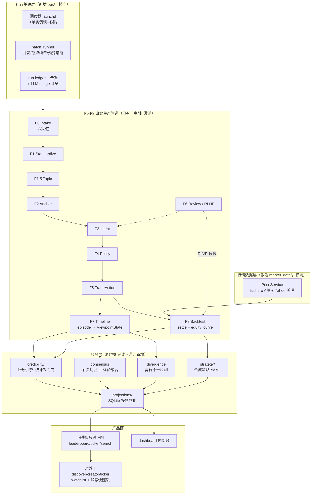

# Finer OS 产品终局形态与架构推进路线图

> 版本：v1.0 | 日期：2026-07-18 | 状态：规划（本文档不含任何代码变更）
> 对标参考：investing.com InvestingPro（Watchlist / Ideas 投资人卡片墙 / ProPicks AI 策略卡）
> 产出方式：6 路只读仓库现状调查 + 3 视角（消费级产品 / 数据工厂 / 可信度护城河）独立终局提案 → 本综合

---

## 1. 概述

一句话：**Finer 的终局是一个「可审计的信源可信度终端」**——把 InvestingPro 的三张产品面（个股 Watchlist、投资人卡片墙、AI 策略卡）搬到「KOL + 外资券商」信源上，但每一个数字都能下钻到 F3→F8 证据链、每一个分数都带统计效力标注；而到达终局的路径**不是先写产品功能，而是先把已编码未激活的流水线拼成无人值守的日更数据工厂**。

本文档回答三个问题：终局长什么样（§2-§3）、现状离终局差哪些必要模块（§4-§6）、按什么顺序补（§7），并集中列出需要用户拍板的红线决策（§8）。

---

## 2. 产品终局形态（North Star）

### 2.1 用户与价值闭环

产品分两层用户：

**内层：运营者（工厂控制台）**。打开控制台看到六渠道摄入水位、各 F-stage 吞吐/失败率/积压、LLM 成本曲线、当日新增 action 与结算翻牌数。整条 F0-F8 由调度器常驻日更：新研报/新内容落盘后 24 小时内自动走完 intake → F1/F2 → intent → F4/F5 → F8 排期结算，全程幂等可重放，失败触发告警。

**外层：投研消费者（先专业投资者/自己人，后散户）**。每天打开产品：

1. **发现页（Ideas 卡片墙对标）**——每个 KOL 和每家外资券商一张卡：净值曲线缩略图、区间收益（1M/3M/1Y）、观点命中率、当前立场持仓数、言行不一计数、**样本量可信度徽章**（样本不足显示灰态而非编造数字）。
2. **Creator 详情页**——虚拟组合净值曲线 vs 基准、当前立场持仓表、逐条观点兑现榜（VERIFIED/FAILED）、言行不一事件列表、每条记录内联 F3→F8 审计抽屉。
3. **个股共识页（Analyst Targets 列对标）**——某只票上跨 KOL/券商的方向共识分布、券商目标价聚合区间（min/median/max vs 现价）、分歧双方各自的历史信誉、该票历史命中率最高的推荐者。
4. **Watchlist 自选页**——每 ticker 一行：现价、共识目标价、多空立场计数、最高兑现率推荐者。
5. **合成策略卡（ProPicks 对标，远期）**——「外资一致强买」「高兑现率 KOL 共振」等规则化组合，月度调仓、回测净值 vs 基准、当期持仓可下钻。

**价值闭环**：持续摄入 → canonical 提取 → F8 自动结算翻牌 → 兑现率/收益率日更累积 → 结算结果作为 RLVR 信号回流训练提取器 → 提取质量提升 → 可信度指标更准。数据资产随时间自增强，历史证据链竞品无法回补。

### 2.2 与 InvestingPro 的差异化（护城河）

InvestingPro 卖「名人组合的收益数字」；Finer 卖「**这个数字为什么可信**」：

- 每个数字可下钻到证据原文（F2 EvidenceSpan → F3 Intent → F4 Policy → F5 TradeAction → F8 结算价格）；
- 每个信源有被市场验证过的 track record（F8 settle 翻牌，非自报）；
- 言行不一被记录在案（stance episode 翻向 + 说做冲突检测）；
- 方法论公开（n 阈值、置信区间口径、结算规则成文并作为产品页面）。

**诚实是护城河的一部分，不是成本**：样本不足就显示「样本不足」，数据只有 10 个月就标注 `data_start_date`，绝不伪造 3Y Return。

---

## 3. InvestingPro → Finer 概念映射

| InvestingPro | Finer 对应物 | 数据来源 |
|---|---|---|
| Ideas 页知名投资人卡（Buffett 29 Holdings +82.3% 3Y） | Creator 记分卡（KOL/券商一张卡） | F7 持仓折叠 + F8 净值/命中率 |
| Holdings 列表 | ViewpointState 虚拟持仓表 | F5 open/add/reduce/close 折叠 |
| 3Y Return 净值曲线 | Creator 净值曲线（诚实标注数据起点） | F8 equity_curve + 行情层 |
| Watchlist 的 Fair Value (Analyst Targets) 列 | 券商 target_price 聚合区间 | F3 `IntentTargetPrice`（25/28 bri intent 已有值，现为无消费者的死数据） |
| Overall Health Label | 信誉分 + 样本量徽章 | credibility_engine + 统计效力门 |
| ProPicks AI 策略卡（回测区间/调仓频率/vs 基准） | 合成策略卡（YAML 规则定义） | strategy 层 + equity_curve 同一管道 |
| WarrenAI 解释 | 证据链审计抽屉（/audit） | 已有，需修券商链断链 |

---

## 4. 现状基线（2026-07-18 调查结论）

完整调查数据见工作流产物；此处只留决定规划的结论。

### 4.1 总判断

**代码完成度远高于运行完成度**。F0-F8 全链「已编码+已测试」，canonical 收口（F5 单一构造点、四要素、settle 状态机）是真的；但真实活水极稀：

- 真实 KOL 仅 trader_ji 一人（121 条 action）；券商链首批 19 条 bri action（9 家券商）；
- 券商漏斗：T3 结构化 4,286 → F0 建档 4,298 → F1 约 29% → F2 约 10% → intent 28 → action 19（**0.44%**），卡点是 F1/F2 批量从未跑完，放量靠仓外 scratchpad 脚本；
- F8 有效结算 n=12（券商）/ n=34（trader_ji episode 口径），**均无统计效力**；
- **无人值守 = 0**：全仓无 cron/launchd/守护进程，两个 watch 循环都是需人工挂起的前台进程。

### 4.2 六个结构性断点（规划直接针对它们）

| # | 断点 | 证据 |
|---|---|---|
| 1 | **驱动器对最大数据源失明**：`broker_research_intake.py` 不调 `F0IndexWriter`，stage_status 零 broker 行，pipeline-drive 发现不了 4,298 条（未来 2.6 万条）broker 内容 | F0 调查；`src/finer/ingestion/broker_research_intake.py` |
| 2 | **审计下钻在券商链断裂**：F4 结果不落盘（`F4_policy_mapped` 下 0 个 bri 文件，policy_id 指向不存在的文件）；honesty note（机构建议非本人仓位）不被 composer 搬入 F5；bri intent evidence 覆盖仅 10/28 | F3-F5 调查；`scripts/drive_broker_recommendations.py`、`extraction/action_composer.py` |
| 3 | **F7 是立场层不是持仓层**：`ViewpointState` 是文档幽灵（AGENTS.md 宣称、代码零定义），快照只有方向标签无仓位语义，答不了「他在 3 月 5 日虚拟组合长什么样」；组合净值/基准对比/再平衡零代码，`backtest/engine.py` 对真实 per-action 数据不可用 | F6-F8 调查；`timeline/stance_episodes.py` 已实现其大半语义 |
| 4 | **无消费级读模型**：所有产品读都是每请求 glob 扫 JSON 现算，`api/routes/kol.py` 还在读 legacy L5/L6 目录（与现役数据断层）；无榜单/个股聚合/搜索端点，无用户体系 | 产品面调查 |
| 5 | **行情与成本基建未激活**：`market_data/` tushare parquet 模块零激活；现役行情只有无 key Yahoo 串行（千级 ticker 必被限流）；LLM usage 计量 token 字段全空、预算熔断只在 NAS 外部脚本 | 数据/运维调查 |
| 6 | **真相源三处分裂**：chore/quality-collar 13 commits 未 push、PR #8（autodrive + policy 可调面）未合并、25 个 broker untracked 文件——autodrive 在 main 上不存在，memory 记载领先于任何分支 | 路线调查 |

### 4.3 已就位、规划中直接复用的资产

- F5 单一构造点 + canonical_trace_status + settle 状态机（全链最扎实部件）；
- F8 per-action 评估 + horizon 三档窗口（R5 已修）+ Yahoo 日缓存；
- `timeline/stance_episodes.py`（episode 计分，ViewpointState 的语义原型）；
- A3 声明式券商适配器（零 LLM，幂等，112 测试）+ F2 broker 实体注册表 + ticker 归一；
- `/audit` 证据审计台、`/radar` live 适配层、kol-check 冻结快照模式（对外静态轨的原型）；
- NAS `rag_system/structured_extract.py` 实战验证过的并发 32/断点续传/预算熔断模式（待迁入仓内）；
- KOL registry / sector proxy / 契约漂移防护 等文件真值机制（新模块沿用同模式）。

---

## 5. 目标架构总图

原则：**不新增 F9**。F0-F8 是「事实生产管道」；终局所需的新能力全部声明为**横向公共层**或 **F7/F8 的只读下游服务层**——它们不产生新的 canonical 事实，只做调度、聚合、投影与呈现，可随时从 F5/F7/F8 文件真值重建。

架构影响声明（需同步到 `AGENTS.md` / `CLAUDE.md` 的条目）：

1. 新增目录 `src/finer/ops/`（调度/批量/观测）、`src/finer/credibility/`（评分/共识/言行不一）、`src/finer/projections/`（投影物化）、`src/finer/strategy/`（合成策略，远期）——全部登记为横向公共层，只读消费 F5/F7/F8 产物，禁止反向写入 F-stage 数据目录（投影库除外）。
2. `ViewpointState` 从文档幽灵转正为 F7 core schema（消灭 AGENTS.md 与代码的矛盾）。
3. 投影 SQLite 与 stage_status 同一原则：**文件真值优先，SQLite 只是热索引/投影，可随时重建**。

---

## 6. 必要模块清单（本次规划的核心交付）

三份独立提案在 P0 上完全收敛；以下是去重合并后的 canonical 模块注册表。每个模块给出：目的 / 挂载位置与依赖 / 新增 schema / 优先级。

### 6.1 运行基建组（全部 P0，多数是「激活/拼装」而非新写）

| ID | 模块 | 目的与做法 | 挂载/依赖 | 新 schema |
|---|---|---|---|---|
| OPS-1 | **broker F0 索引注册**（f0_pm_bridge） | `broker_research_intake.py` 成功路径补 `F0IndexWriter` 注册；一次性回填脚本把存量 4,298 条补进 stage_status（幂等谓词）。这是「驱动器看见最大数据源」的第一块多米诺 | F0；`f0_index_writer.py` | 无（stage_status 补 `source_channel` 列 → 红线 §8-2） |
| OPS-2 | **驱动器渠道/阶段控制** | pipeline-drive 加 `--channel broker\|feishu\|...` 与 `--stages f1,f2` 参数；解除每轮强制 F5+settle；移除 bilibili 硬编码排除，改为渠道能力声明 | cross-stage；`pipeline/driver.py`；依赖 OPS-1 | `DriveRunConfig`（每轮参数落 pipeline_runs，可重放） |
| OPS-3 | **batch_runner 并发批量执行池** | driver 单线程串行（F1 含 OCR 60-80s/份，26k 串行≈3周不可行）。把 NAS `structured_extract.py` 实战验证的并发 32/断点续传/预算硬顶/quota 熔断迁入仓内 `pipeline/batch_runner.py`，driver 与 backfill 脚本共用；同时把本次 scratchpad 放量脚本收编为仓内可复现入口 | 横向；依赖 LLM usage 计量与 vision 冷却修复（未提交 diff 先合入） | `BatchRunManifest`（run_id/进度/失败/token 花费/checkpoint 游标） |
| OPS-4 | **调度器壳 scheduler_shell** | launchd plist 包裹 pipeline-drive --watch 与 feishu-watch + `fcntl.flock` 单实例锁 + heartbeat 文件。不引入 celery/redis——文件真值架构下没必要。与 PR #8 的 server-lifespan autodrive 二选一（建议 launchd 独立进程，与 API 服务解耦，见 §8-5） | 横向；`configs/launchd/*.plist` + driver 锁 | `HeartbeatState`（文件真值，控制台读它判存活） |
| OPS-5 | **观测与告警 observability** | ①run ledger：每轮 drive/settle/materialize 落结构化记录；②飞书 webhook 告警（心跳超时/失败率/预算超限三类，复用 lark 基建）；③修 `LLMClient.chat` 丢弃 usage 的 bug 使 token 计量真实生效 + 仓内预算硬顶；④日志轮转。**与 OPS-4 绑定交付**——否则无人值守退化为无人知晓 | 横向 `ops/`；`llm/client.py` | `RunLedgerEntry`（复用 canonical error envelope）、`AlertEvent` |
| OPS-6 | **存储决策与备份策略** | 73GB raw 在可拔外置盘（symlink 归档，盘拔则 F1 全挂、raw 不可变性作废）→ 放量前必须显式决策（§8-1）；14 个手工 .bak 目录 → 保留策略成文 + 清理脚本 | F0 存储契约 + 运维 | 无（规则写 spec） |

### 6.2 审计完整性组（P0，护城河的字面前提）

| ID | 模块 | 目的与做法 | 挂载/依赖 | 新 schema |
|---|---|---|---|---|
| AUD-1 | **券商链 F4 落盘** | `drive_broker_recommendations.py` 把 `PolicyMappingResult` 落盘 `F4_policy_mapped/{policy_id}.json`（遵守 audit_assembler 既有读取约定），修复 policy_id 指向不存在文件的断链 | F4/F5 边界 | 无 |
| AUD-2 | **honesty note 贯通 + signal_class** | `action_composer.build_action_metadata` 搬运 risk_notes 中的机构建议标记；`TradeAction` 增 `signal_class: Literal['kol_statement','broker_recommendation']`（模块级 Literal 常量，同步 contracts.ts + drift REGISTRY 登记） | F5 单一构造点内扩展 | `signal_class` 字段 |
| AUD-3 | **三向引用完整性审计** | 只读脚本 `scripts/audit_trace_integrity.py`：遍历全部 F5 action 验证 intent_id/policy_id/evidence_span_ids 可解引用，输出完整率报告，接进 CI——「每个数字可下钻」从宣称变成被守护的不变量 | 横向审计脚本 | 无 |
| AUD-4 | **F2 增强波全量重跑** | broker 实体注册表收口后全量重跑 F2（红线 §8-3），目标把 bri intent evidence 覆盖 10/28 → 可过 F5 硬门的水平（100 份冒烟实测产率上限 52%，需重测）；顺带补后缀归一表（.PA/.FP/.B/NSDQ）与裸 EW 撞评级术语修复 | F2 | 无 |

### 6.3 行情数据层（P1 前段；放量后千级 ticker 结算的硬前提）

| ID | 模块 | 目的与做法 | 挂载/依赖 | 新 schema |
|---|---|---|---|---|
| MKT-1 | **tushare 激活灌数** | `market_data/`（fetcher/storage/service/CLI 全套已编码零激活）灌 A 股日线（2016 起 backfill + 每日收盘 job 挂调度器）。需用户提供 token（§8-6） | 横向；依赖 OPS-4 | 复用已有 parquet 列契约（缺则补 Pydantic 镜像） |
| MKT-2 | **Yahoo 加固** | `backtest/yahoo_prices.py` 加信号量并发+指数退避+429 识别+重试；range 支持 >1y（多年净值曲线前提） | F8 内 | 无 |
| MKT-3 | **PriceService 双源路由** | `backtest/prices.py` provider 抽象上加路由：A 股走 tushare、美港走 Yahoo，统一入口供 F8/settle/投影消费 | 横向 | 无 |

### 6.4 可信度与聚合层（新增 `src/finer/credibility/`；评分 P1，共识/言行不一 P1-P2）

| ID | 模块 | 目的与做法 | 挂载/依赖 | 新 schema |
|---|---|---|---|---|
| CRD-1 | **credibility_engine 评分引擎** | 把散在 `opinions.py::_kol_settled_record` 的 episode 命中率+贝叶斯先验抽成独立模块并扩展：horizon 分档兑现率、per-action 跟单收益分布、结算覆盖率（settled/total，防幸存者偏差）、opinion-tier 与 trade-tier 分离计分（已认账工单）。纯确定性，不调 LLM | `credibility/scoring.py`，只读 F5/F7/F8 | `CredibilityScoreCard`（含 hit_rate CI、horizon_breakdown、coverage_ratio、insufficient_sample） |
| CRD-2 | **statistical_validity_gate 统计效力门** | 回答 spec 空白「n 多大才允许把分数呈现给用户」：Wilson 区间、最小样本阈值（如 settled≥30 才出对外分数，20-49 显示数字+警示徽章，<20 灰态只显计数）、切片偏差声明（selection_note）。阈值进 `configs/significance.yaml`（文件真值，仿 kol_registry 模式）；**硬门不是软提示**，被 CRD-1 强制调用、前端强制消费。同时产出 `docs/specs/credibility-methodology.md` 作为对外方法论页的真相源 | credibility/ 内纯函数 + spec | `SampleSufficiency`（内嵌 ScoreCard） |
| CRD-3 | **consensus_aggregator 个股共识** | per-ticker 聚合：方向共识度（**默认等权/仅方向**——conviction 是编造值，敏感度未评估前不用它加权，§8-8）、券商 target_price 分布（min/median/max vs 现价——是 25/28 已落盘 target_price 数据的**第一个真实消费者**）、分歧结构、该票各信源历史命中率 | `credibility/consensus.py`；依赖 CRD-1、`ticker_normalization.py` | `TickerConsensusView` |
| CRD-4 | **divergence_detector 言行不一** | 把老纪真值案例产品化：①说多做空/说空做多（同 ticker 同窗 stance vs action 冲突）；②高调推荐后无声退出；③重述通胀去重（AAPL 常驻框架句跨 content 去重，已认账工单在此一并解决）。每个事件挂双方 evidence_span_ids 可下钻。**假阳性即对信源的不实指控**——上线前人工抽检门槛高于其他模块（<10%） | `timeline/divergence.py`；依赖 stance_episodes | `DivergenceEvent` |

### 6.5 F7 持仓层与 F8 净值（P1 后段-P2；InvestingPro「Holdings + 净值曲线」的无米之炊）

| ID | 模块 | 目的与做法 | 挂载/依赖 | 新 schema |
|---|---|---|---|---|
| PRT-1 | **ViewpointState 转正 + 持仓折叠** | 消灭文档幽灵：`schemas/viewpoint_state.py` 落地（基于 `stance_episodes.py` 已实现语义提升为显式模型）；折叠 F5 open/add/reduce/close 为逐日持仓状态（权重先做等权或 conviction 三档简化，不做复杂 sizing）；`build_snapshot` 加 as_of_date 参数支持任意时点重放 | F7 `timeline/portfolio_state.py` | `ViewpointState`、`VirtualPortfolioSnapshot`（as_of_date + positions + net_exposure）；AGENTS.md 幽灵条目同步修正 |
| PRT-2 | **equity_curve 净值与基准** | 基于 VirtualPortfolioSnapshot 逐日重放 + 收盘价 → 每 Creator 净值曲线与基准（沪深300/SPX 按持仓市场混合）超额，落 `data/F8_metrics/equity_curves/`。**明确绕开 `backtest/engine.py`**（对 per-action 数据是错误工具：同票去重/误开空/混时区崩溃），不修它 | F8 `backtest/equity_curve.py`；依赖 PRT-1、MKT-* | `EquityCurvePoint`、`CreatorPerformanceSummary`（含 `data_start_date`——诚实暴露语料仅 ~10 个月，不伪造 3Y） |
| PRT-3 | **F8 批量结算日更 job** | settle 从手动 CLI 变 scheduler 驱动每日 job：新 action 排期、到期翻牌、R5 分档窗对存量回填重结算（红线 §8-3）。同时 `BacktestResult` 补 `evaluation_window_days: int` / `window_truncated: bool` 结构化字段，消灭 `[window=Nd]` 字符串后缀这个已认账 schema gap | F8 `scripts/settle_daily_job.py` 薄壳；依赖 OPS-4、MKT-* | BacktestResult 两个新字段、`SettleRunReport` |

### 6.6 投影物化与消费级 API（P1；消费级读流量的唯一可行架构）

| ID | 模块 | 目的与做法 | 挂载/依赖 | 新 schema |
|---|---|---|---|---|
| PROJ-1 | **read_model_materializer** | 定时任务把 F5/F7/F8 + credibility 产物物化到 SQLite 投影表：`creator_scorecard` / `ticker_consensus` / `divergence_events` / `leaderboard`（带 computed_at 水印、增量重算脏 creator/ticker）。API 只读表不扫文件；**顺带废除 `kol.py` 的 legacy L5/L6 glob 读路径**。投影可随时从文件真值重建（新表属红线 §8-2） | `projections/materializer.py` + `data/projections.sqlite3`；依赖 CRD-*、PRT-*、OPS-4 | `KolScorecardRow`、`TickerConsensusRow`、`LeaderboardEntry`（先定 Pydantic 再建表，同步 contracts.ts） |
| PROJ-2 | **consumer_api 消费级只读 API** | 三个新路由：`leaderboard.py`（游标分页+筛选）、`ticker.py`（GET /api/ticker/{symbol}/consensus、/timeline）、`search.py`（FTS 查 creator+ticker）。全部只读投影表、canonical envelope、每条记录带下钻 action_ids | api/routes/；逻辑在 projections service | `CursorPage[T]` 分页 envelope |

### 6.7 产品面（P2；数据层就绪前做页面 = 又一批 fixture 空壳）

| ID | 模块 | 说明 |
|---|---|---|
| UI-1 | `/discover` 发现页卡片墙：读 /api/leaderboard，净值 sparkline + 收益/命中率/样本量筛选，KOL 与券商混排；晨星审美走 `finance-frontend:finer-financial-frontend-design` skill |
| UI-2 | Creator 详情页重构 `/kol/[id]`：scorecard + equity curve + ViewpointState 持仓表 + 兑现榜 + 言行不一区，废除 legacy 读路径；卡片数字全部内联 /audit 抽屉（3 次点击内到达 EvidenceSpan 原文） |
| UI-3 | `/ticker/[symbol]` 个股共识页：共识分布、目标价区间条、立场时间线、推荐者兑现率排序（把现有 kol-ticker fixture 组件接 live） |
| UI-4 | 全局搜索入口（FTS 已有基础） |
| UI-5 | kol-check 快照产线化：冻结脚本对任意 creator 可再生匿名快照 → 静态部署 finer.t800.click（对外低成本验证轨，可提前到 P1 末；源码需先从 feat/kol-check-demo 分支合回主线） |
| UI-6 | 工厂控制台：dashboard 工作流看板接 heartbeat/ledger/usage 三个数据源（内部） |

### 6.8 对外产品化与训练闭环（P3）

| ID | 模块 | 说明 |
|---|---|---|
| EXT-1 | **用户层 + Watchlist**：最小 auth（magic link 或先单用户）、watchlist CRUD、行视图 join ticker_consensus。明确不做多租户。schema：`UserProfile`、`WatchlistEntry` |
| EXT-2 | **合成策略层 strategy/**：策略定义走 YAML 文件真值（`SyntheticStrategyConfig` rule DSL：min_consensus/creator_filter/rebalance_freq），月度调仓经 equity_curve 同一管道回测出策略卡。**必须过统计效力门才有资格上卡**（付费层核心卖点） |
| EXT-3 | **对外只读部署**：托管只读 API（限流+脱敏）或全静态快照方案，按届时流量二选一 |
| EXT-4 | **合规 spec**（§8-7 详述）：非投顾声明组件（所有收益数字旁强制）、券商研报只展示结构化结论+短句引用（版权边界）、显著性呈现规则成文并被前端组件强制执行 |
| EXT-5 | **rlvr_reward_loop 训练飞轮**：F8 settle 翻牌 = 对提取质量的免费延迟真值。`settle.py` 加回调产出 `SettleFeedbackCandidate` 落 `data/rlhf/candidates/` → annotation 台抽检队列 → 通过者转 DPO pair（复用现有 export 链）→ 跑通第一轮真实实训（ml/ 手动流程即可）。突破「RLHF API 完整但零流量」的冷启动 |
| EXT-6 | **数据源扩展**：2026 年研报解锁（stall detector 判据更新 + 157 份 pypdf 假失败换 pdfplumber 零成本救回）、第 2-3 个真实 KOL 全链跑通（摆脱单人样本）、研报持续订阅管道（语料止于 2026-06，不建则上线即变陈旧） |

---

## 7. 分阶段路线图（每阶段有可验收的门）

> 阶段门禁以**验收数据量**而非代码合入为准——P0 全是「激活+管道」没有可见新功能，最大的执行风险是跳过它直接做页面（那会重演「页面真、数据假、全是空态」的现状）。

### Phase 0 · 激活收口（1-2 周）

**目标**：不写产品新功能，把存量件拼成一条自转的线。

内容：真相源合流（§8-5，第 0 项）→ OPS-1/2/3/4/5 → AUD-1/2/3/4 → broker F0 放量导入决策与执行（§8-1/§8-9，先 1,000 份金丝雀批校准吞吐/失败率/成本，再全量）。

**验收门**：
- pipeline-drive 以 launchd 常驻，无人值守连续 ≥72h，心跳持续、失败有 ledger 与告警记录；
- broker 存量全部注册进 stage_status，`--channel broker` 能发现并驱动；
- F1 完成 ≥4,000 份、F2 批量锚定完成、A3 对 burn_all.jsonl 全量执行（预期数百条 bri intent）、券商 canonical action 过百条；
- `audit_trace_integrity.py` 报告 100% 三向引用可解引用（任一券商 action 在 /audit 下钻不断链）；
- LLM 花费有真实计量（token 字段非空）与预算硬顶。

### Phase 1 · 数据变产品原料（2-3 周）

**目标**：出第一批带统计纪律的分数，产品读与生产算分离。

内容：MKT-1/2/3 → PRT-3（F8 日更结算+窗口回填）→ CRD-1/2 → PROJ-1/2 → PRT-1 并行开工；UI-5 快照轨对 2-3 家券商生成静态卡片页做低成本观感验证。

**验收门**：
- 每日自动节拍稳定：收盘灌行情 → 结算翻牌 → 投影重算 → 告警静默即健康；
- 所有有结算数据的信源产出 CredibilityScoreCard，hit_rate 带 Wilson 区间；settled<阈值正确显示 insufficient_sample（单元测试钉死）；
- GET /api/leaderboard 与 /api/ticker/{symbol}/consensus 真实数据非空且带 significance_tier；ticker_consensus 覆盖 ≥100 只标的的目标价聚合；
- legacy L5/L6 读路径下线；`docs/specs/credibility-methodology.md` 落地；
- 1,000 ticker 日结算压测通过（行情层加固后）。

### Phase 2 · 消费级界面（2-4 周）

**目标**：把投影变成 InvestingPro 三张图（先 dashboard 内部/受控上线）。

内容：UI-1/2/3/4 → CRD-3/4（共识页与言行不一面上线）→ PRT-2（净值曲线先 per-action 累计近似，持仓折叠就绪后换组合版）→ 第二个真实 KOL 全链跑通 → KOL 存量清理（R7 偏置重跑与误归属处置，§8-3/§8-4）。

**验收门**：
- /discover、/kol/[id]、/ticker/[symbol] 三页真实数据渲染非空；任一数字 3 次点击内到达 EvidenceSpan 原文；
- 样本不足的 creator 显示灰态徽章而非误导数字；
- divergence 在真实数据复现老纪案例且人工抽检假阳性 <10%；
- 共识页对任选 10 个多信源 ticker 与手工核算一致；
- tsc/npm build/契约 drift 检查全绿。

### Phase 3 · 对外产品化与飞轮（4-6 周，持续）

**目标**：外部用户可用；策略卡上线；训练闭环转起来。

内容：EXT-1/2/3/4/5/6 → PRT-1/2 组合版净值曲线上卡。

**验收门**：
- 外部用户可注册、建 watchlist、浏览卡片与个股页；只读 API 经缓存/限流公网部署；
- ≥2 个合成策略过统计效力门上线策略卡；
- 合规 spec 成文并被前端组件强制执行；
- ≥100 条 SettleFeedbackCandidate 流过抽检队列、完成一轮 DPO 实训且 eval 不劣化；
- 2026 研报批次解锁进入日更管道。

---

## 8. 关键决策（红线清单，需用户逐项拍板）

> **2026-07-18 决策更新**：#1 已决=保持外置盘+护栏；#2 已决=一次性授权全部（含 Phase 1 投影表，条件：先备份）；#3 已决=F2 全量重锚 / F8 窗口回填 / 42 条重提取（前提：F3 护栏先移植 llm prompt 层）全部授权；#4 已决=删除课代表归属（以 quarantine 方式落地）；#5 已决=全部合流（push quality-collar + 合并 PR #8 + broker 波提交）；#9 部分=金丝雀 1,000 份授权，全量待金丝雀报告。执行细则见 `docs/specs/2026-07-18-phase0-activation-task-cards.md`。#6/#7/#8/#10 仍待决。

路线图约半数关键步骤卡在需授权的红线上。**建议在 Phase 0 开工前一次性批量决策，避免逐次卡壳**：

| # | 决策 | 影响 | 建议 |
|---|---|---|---|
| 1 | **R8 外置盘归属**：73GB raw 迁内置盘 / NAS 常挂 / 接受拔盘风险 | 不决策则放量越深、流沙越陷（盘拔则 F1 全挂、raw 不可变性作废） | 放量前必须定；倾向迁移或双备份 |
| 2 | **SQLite 变更授权**：stage_status 补列与存量回填（OPS-1）、投影新表（PROJ-1） | P0/P1 的硬前提 | 投影表可随时从文件重建，风险低 |
| 3 | **批量重跑授权**：F2 全量重锚（AUD-4）、F8 存量窗口回填（PRT-3）、KOL 42 条 R7 偏置重提取 | 数据口径统一的前提 | 每次跑前备份，沿用既有 .bak 模式 |
| 4 | **删除授权**：课代表粉丝 PDF 误归属 trader_ji（2 条已结算败绩在拿别人写的东西给他记账） | 问责公平性 | 建议删除归属并重算 |
| 5 | **git 真相源合流**：push chore/quality-collar 13 commits；PR #8 合并或砍（autodrive 走 server-lifespan 还是 launchd 独立进程——本规划建议 launchd，则 PR #8 的 autodrive 部分可降级为参考）；25 个 broker untracked 提交 | 一切并行开发的前置 | Phase 0 第 0 项 |
| 6 | **行情源**：tushare token 提供；美港千级 ticker 是否需要付费行情源 | MKT-1 与 Phase 1 压测 | 先 tushare+Yahoo 加固，压测后再决定采购 |
| 7 | **产品合规定位**：「观点验真/追责工具」vs 任何形式的荐股表达；对外呈现 TradeAction 级信息的措辞边界；28k 份投行研报衍生结论+短引用的再分发边界 | 终局最大未决风险（全仓零合规 spec） | 坚持「历史事实陈述」措辞，绝不出现「建议买入」；Phase 3 前完成合规 spec 评审 |
| 8 | **conviction 编造值的使用边界** | 它进入 F4 sizing 与潜在的共识加权，但敏感度未评估 | 共识聚合默认等权/仅方向；用放量后 F8 数据反向校准前不加权 |
| 9 | **全量导入解除 `--limit` 护栏**（2.2 万份） | Phase 0 放量 | 金丝雀 1,000 份校准后分批授权 |
| 10 | **R6 分析师 vs 机构粒度**：扁平 creator_id 把不同 desk 合并制造假翻转；拆分析师则样本塌陷 | 券商记分卡的语义正确性 | 短期按机构出卡+页内按报告下钻；分析师维度作为 metadata 累积，样本够了再升维（真实建模分叉，需显式接受） |

---

## 9. 风险（合并三提案，按严重度）

1. **统计效力（最高）**：现役 n=12/34 全是噪声，且来自「恰好有 F2 锚点」的非随机切片；若放量后可结算样本仍不足（evidence 硬门实测产率仅 52%），**推迟记分卡而不是降低 n 阈值**。绕过统计效力门抢先展示数字 = 摧毁「诚实」这个唯一护城河。
2. **合规空白**：投顾边界、研报版权、conviction 编造值参与 sizing——对外开放任何面之前需要专门合规评审（§8-7）。
3. **exit 参数循环依赖**：horizon 三档止损止盈是拍脑袋值且从未被回测验证，净值曲线建立在其上；需在 Phase 1 用放量后 F8 数据反向校准，并在卡片标注方法论版本。
4. **吞吐假设未经验证**：F1 历史最大批次 267 份，26k 规模的失败率/配额/耗时未知——金丝雀批先行，再承诺时间表。
5. **调度静音失败**：launchd 化把失败从「终端可见」变「后台无声」，OBS 必须与调度绑定交付。
6. **单点样本**：KOL 侧只有 trader_ji；「卡片墙」短期实质是券商墙。第二、三个 KOL 全链跑通是 Phase 2 验收项。
7. **数据时间跨度**：语料 ~10 个月、研报止于 2026-06；做不了 3Y Return 对标，且不建订阅管道则上线即陈旧。卡片必须诚实标 data_start_date。
8. **言行不一的声誉风险**：假阳性 = 对信源的不实指控；抽检门槛高于其他模块，每个事件必须挂可下钻证据。
9. **LLM 成本失控**：usage 计量修复与预算硬顶必须先于放量（OPS-3/5 含），不是随后补。

---

## 10. 变更清单

| 文件 | 类型 |
|---|---|
| `docs/specs/2026-07-18-product-north-star-architecture-roadmap.md` | 新增（本文档；纯规划，无代码变更） |

## 11. 验证结果

本次为规划任务，无代码/数据变更需验证。规划依据：9 个只读 agent（6 路仓库现状调查覆盖 F0-F2 / F3-F5 / F6-F8 / 产品面 / 数据运维 / spec 路线，+3 路独立终局提案），全部只读执行，产物存于会话工作流 `wf_dff24837-273`；另人工复核 `docs/specs/2026-07-15-broker-research-source-integration.md`、`docs/specs/ux-information-architecture-and-kol-rating-system.md` 及项目 memory。三份独立提案在 P0 优先级上完全收敛（激活收口 > 审计完整性 > 一切新功能），是本路线图置信度的主要来源。

## 12. 未解决项

- §8 全部 10 项红线决策（规划完成 ≠ 授权完成）；
- R6 分析师身份建模的长期方案（跳槽追踪、desk 拆分）仅给了过渡策略；
- 美港股千级行情源选型（压测后决定）；
- 转写语料（llm 路径）的 F3 护栏移植到 prompt 层（rule 护栏不适用于 `f3_llm_consensus` 存量）；
- settle 的 opinion-tier 与 trade-tier 分离计分的具体口径（CRD-1 内落地时定）；
- 合成策略 rule DSL 的表达力边界（P3 设计时定）；
- 46 个阻塞 async handler 的 sweep（已 spawn 独立任务，不入本路线主线）。
